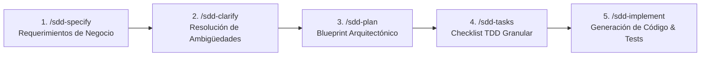

# 🤖 AGENTS.md — Contrato de Gobernanza y Directivas de Arquitectura para Google Antigravity (AGY)
## Plataforma Cloud Native & AI-Assisted Engineering — Caso de Uso: Retail Enterprise (GCP 2026)

> **PROPÓSITO DE ESTE DOCUMENTO:**  
> Este archivo es el contrato maestro de gobernanza arquitectónica y desarrollo asistido por IA para **Google Antigravity CLI (`agy`)**, agentes autónomos y desarrolladores. Define los estándares no negociables, directivas de codificación, integración de skills, flujos SDD, configuración de CI/CD con Cloud Build y manifiestos declarativos para Google Kubernetes Engine (GKE) aplicados a una arquitectura de **Retail Enterprise**.
>
> Toda interacción con Antigravity en este repositorio DEBE acatar estrictamente las directivas aquí plasmadas.

---

## 🧭 1. Principios Rectores y Filosofía de Ingeniería

1. **Spec-Driven Development (SDD) Primero:** Ningún código de producción se genera sin una especificación contractual previa (`specs/*.spec.md`) que defina modelos de dominio, casos de uso, contratos de API, severidades de observabilidad y criterios de aceptación.
2. **GitOps Determinista Puro (Zero Local Cloud SDK Deploy):** Queda terminantemente prohibido ejecutar despliegues directos a producción o clústeres desde máquinas locales mediante comandos manuales de Cloud SDK (`gcloud run deploy`, `gcloud compute instances create`). Todo artefacto y manifiesto se versiona en Git; **Google Cloud Build** es la única entidad autorizada para orquestar builds, análisis de seguridad y despliegues en GKE tras un evento `git push origin main`.
3. **Eficiencia y Minimalismo (Ponytail Dogma):** No incurrir en sobreingeniería. Si la biblioteca estándar de Node.js o las APIs nativas del navegador resuelven el problema, se prefieren sobre dependencias de terceros pesadas.
4. **Optimización Obligatoria de Contexto con RTK:** Todo comando ejecutado en terminal o por subagentes DEBE emplear el prefijo `rtk` (`rtk git`, `rtk npm`, `rtk kubectl`, `rtk ls`, etc.), ahorrando entre el 60% y 90% de la ventana de contexto de los modelos de IA.
5. **Observabilidad Estructurada Nativa:** Todo microservicio emite eventos en formato JSON estructurado compatible con **Google Cloud Logging**, incluyendo severidades estándar de GCP (`INFO`, `WARNING`, `ERROR`, `EMERGENCY`) y vinculación automática al contexto de traza distribuida (`logging.googleapis.com/trace`).

---

## 🛠️ 2. Skills Activos y Directivas de Uso

| Skill | Ejecución / Paquete | Rol en el Proyecto |
| :--- | :--- | :--- |
| **RTK (Rust Token Killer)** | Instalación de sistema (`brew install rtk` / Cargo / binario según OS) | Proxy CLI obligatorio para filtrar salidas de consola y reducir consumo de tokens en prompts y subagentes (60% a 90% de ahorro en la ventana de contexto). |
| **SDD Skill** | `github.com/develasquez/sdd-skill` | Orquestador del ciclo de vida de especificaciones formales (`/sdd-specify`, `/sdd-clarify`, `/sdd-plan`, `/sdd-tasks`, `/sdd-implement`). |
| **Vanilla-Core UI** | `npx vanilla-core-ui` | Arquitectura frontend reactiva sin frameworks pesados basada en Single Source of Truth (`store.js`), Pub/Sub desacoplado y renderizado quirúrgico anti-thrashing. |
| **Material Design 3** | `npx @develasquez/material-design` | Tokens de diseño, sistema de color HCT, elevación, tipografía y componentes accesibles bajo lineamientos de Material You 2026. |

---

## 📐 3. Ciclo de Vida SDD por Dominio (Specification-Driven Development)

Para cada componente del sistema (Frontend, Backend, Infraestructura/DevSecOps), se sigue la secuencia estricta de 5 fases:



### Reglas de Ejecución SDD:
- `/sdd-specify`: Genera o actualiza el archivo en `specs/<dominio>.spec.md`. Contiene: Requerimientos funcionales y no funcionales del dominio, entidades, contratos HTTP/JSON, severidades de observabilidad y criterios de aceptación.
- `/sdd-clarify`: Identifica supuestos ocultos, límites de concurrencia y validaciones de borde.
- `/sdd-plan`: Define la estructura exacta de carpetas, interfaces y dependencias mínimas requeridas.
- `/sdd-tasks`: Lista de tareas ordenadas por prioridad de pruebas (TDD).
- `/sdd-implement`: Escribe el código asegurando que todos los tests unitarios pasen al 100%.

---

## 🎨 4. Estándares de Codificación: Frontend (Vanilla-Core UI + Material Design 3)

### 📂 Estructura de Directorios Obligatoria:
```text
frontend/
├── components/                  # Componentes autocontenidos
│   ├── header/                  # header.html, header.js
│   ├── catalog/                 # catalog.html, catalog.js
│   └── chaos-panel/             # chaos-panel.html, chaos-panel.js
├── ui/
│   └── renderer.js              # Renderizador global quirúrgico (anti-thrashing)
├── store.js                     # Single Source of Truth (SSoT) + Pub/Sub
├── dom-elements.js              # Mapeo centralizado de IDs del DOM
├── index.html                   # App Shell con Tailwind & Material Design 3
├── load.js                      # Cargador asíncrono de componentes
├── main.js                      # Orquestador e inicializador
├── server.js                    # Servidor estático Express (Puerto 80, /health)
├── style.css                    # Estilos globales y tokens M3
└── Dockerfile                   # Multi-stage non-root container
```

### 📋 Reglas de Codificación Frontend:
1. **Single Source of Truth (SSoT):** Todo el estado dinámico (catálogo de retail, reservas de stock, tienda seleccionada, transacciones, errores) reside exclusivamente en `store.js`.
2. **Inmutabilidad Externa:** Ningún componente puede mutar el objeto `state` directamente. Todo cambio se realiza mediante `setState({ ... })`.
3. **Renderizado Quirúrgico (Anti-Thrashing):**
   - En `ui/renderer.js`, NUNCA sobrescribir con `innerHTML` contenedores con foco activo de usuario o campos de texto mientras se escribe.
   - Actualizar únicamente los nodos de texto o atributos que hayan cambiado.
4. **Diseño Material 3:** Usar tokens de `npx @develasquez/material-design` (paleta HCT, tonos surface, primary container, on-primary, error container).
5. **Servidor Web:** Express estático sirviendo en el puerto `80`, con endpoint `GET /health` que responde HTTP 200 para las sondas de GKE.

---

## ☕ 5. Estándares de Codificación: Backend (Node.js 20 + TypeScript + Clean Architecture)

### 📂 Estructura de Directorios Obligatoria:
```text
backend/
├── src/
│   ├── domain/                  # Lógica pura de negocio (agnóstica de frameworks)
│   │   ├── entities/            # Entidades (Product con sku, name, category, price, stock, storeId)
│   │   ├── errors/              # Excepciones de dominio (InsufficientStockError, ProductNotFoundError)
│   │   └── use-cases/           # Casos de uso (ReserveStockUseCase, ChaosUseCase)
│   ├── infrastructure/          # Adaptadores y drivers externos
│   │   ├── http/                # Servidor Express, rutas y middlewares
│   │   └── logger/              # Logger estructurado de Google Cloud
│   └── index.ts                 # Bootstrap de la aplicación
├── tests/                       # Pruebas unitarias con Vitest (*.test.ts)
├── Dockerfile                   # Multi-stage non-root container
├── tsconfig.json
└── package.json
```

### 📋 Reglas de Codificación Backend:
1. **Dominio Aislado:** Los casos de uso (`src/domain/use-cases/`) NO deben importar dependencias HTTP (`express`, `req`, `res`). Reciben DTOs y retornan resultados o lanzan excepciones de dominio.
2. **Logger Estructurado de Google Cloud:**
   - Clase: `StructuredLogger` en `src/infrastructure/logger/structured-logger.ts`.
   - Soporte de severidades: `INFO`, `WARNING`, `ERROR`, `EMERGENCY`.
   - Propiedad de correlación de trazas: `logging.googleapis.com/trace` con formato:  
     `projects/${GCP_PROJECT_ID}/traces/${TRACE_ID}`.
   - La severidad `EMERGENCY` debe utilizarse exclusivamente para fallos fatales que comprometan la continuidad del contenedor.
3. **Endpoint de Caos (Chaos Testing):**
   - Ruta: `POST /api/v1/chaos/crash`.
   - Comportamiento: Emite un log `EMERGENCY` con stack trace forense y ejecuta `process.exit(1)` con un pequeño retardo (100ms) para forzar la muerte del contenedor y validar la auto-recuperación de Pods en GKE.
4. **Pruebas Unitarias Obligatorias:**
   - Framework: **Vitest**.
   - Cobertura mínima: 100% de los casos de uso principales (éxito, inventario insuficiente, producto inexistente, disparo de caos).
   - Comando de ejecución: `rtk npm test`.

---

## ⚡ 6. Estándares de Integración Continua (Google Cloud Build)

El archivo `cloudbuild.yaml` en la raíz del repositorio debe cumplir con las siguientes especificaciones:

1. **Grafo Acíclico Dirigido (DAG) con `waitFor`:**
   - `test-backend`: Corre tests con Vitest inmediatamente (`waitFor: ['-']`).
   - `build-backend`: Construye imagen Docker de backend solo si los tests pasaron (`waitFor: ['test-backend']`).
   - `build-frontend`: Construye imagen Docker de frontend en paralelo desde el inicio (`waitFor: ['-']`).
   - `scan-backend` y `scan-frontend`: Escanean con `aquasec/trivy:latest` en paralelo tras sus respectivos builds (`waitFor: ['build-backend']` / `waitFor: ['build-frontend']`).
   - `push-images`: Sube ambas imágenes a Google Artifact Registry (`retail-docker-repo`).
   - `deploy-k8s`: Aplica los manifiestos en GKE de forma declarativa solo tras haber aprobado los escaneos de seguridad y el push.
2. **Escaneo de Vulnerabilidades Trivy:**
   - Imagen: `aquasec/trivy:latest`.
   - Severidad filtrada: `HIGH,CRITICAL`.
   - Argumentos estándar: `image --no-progress --severity HIGH,CRITICAL --exit-code 0 <IMAGE>`.
3. **Sustituciones Dinámicas:**
   - `_CLUSTER_NAME`: Nombre del clúster GKE (`retail-private-cluster`).
   - `_CLUSTER_LOCATION`: Región o zona (`us-central1-a`).
   - `_REPO_NAME`: Repositorio en Artifact Registry (`retail-docker-repo`).
   - Inyección automática del `$SHORT_SHA` en los deployments de Kubernetes mediante `sed`.

---

## ☸️ 7. Estándares de Manifiestos para Google Kubernetes Engine (GKE)

Todos los manifiestos declarativos deben ubicarse en `k8s/`:

1. **Namespace:** Todo recurso debe pertenecer al namespace `retail-store` (`k8s/namespace.yaml`).
2. **Container-Native Load Balancing (NEG):**
   - Todo `Service` expuesto a Ingress debe incluir la anotación:
     ```yaml
     annotations:
       cloud.google.com/neg: '{"ingress": true}'
     ```
   - Enruta tráfico L7 directamente a las IPs de los Pods sin saltos NodePort intermedios ni kube-proxy SNAT.
3. **Sondas de Salud (Health Probes):**
   - `readinessProbe`: Valida que el Pod esté listo para recibir tráfico (`/ready` en backend, `/health` en frontend).
   - `livenessProbe`: Valida que el Pod esté con vida (`/health`). Si falla, el Kubelet reinicia el contenedor.
4. **Gobernanza de Recursos (FinOps & Stability):**
   - Todo contenedor debe tener declarados explícitamente `resources.requests` y `resources.limits` en CPU y Memoria.
5. **Horizontal Pod Autoscaler (HPA):**
   - Archivo `k8s/hpa.yaml` con API `autoscaling/v2`.
   - Objetivo: Mantener la utilización promedio de CPU al 70%.
   - Réplicas mínimas: 2. Réplicas máximas: 10.
6. **Separación de Secretos y Configuración:**
   - Variables no sensibles en `ConfigMap` (`k8s/configmap.yaml`).
   - Credenciales sensibles simuladas en `Secret` (`k8s/secret.yaml`).
   - Consumo en Deployments mediante `envFrom` y `secretKeyRef`.

---

## 📋 8. Matriz de Comportamiento del Agente Antigravity

Al interactuar con el usuario o recibir instrucciones:

| Situación | Acción Requerida del Agente |
| :--- | :--- |
| El usuario pide crear una nueva funcionalidad | Ejecutar el ciclo SDD: `/sdd-specify`, `/sdd-clarify`, `/sdd-plan`, `/sdd-tasks`, `/sdd-implement`. |
| El usuario solicita ejecutar un comando en consola | Usar SIEMPRE el prefijo `rtk` (`rtk git status`, `rtk npm test`, etc.). |
| El usuario pide modificar el frontend | Respetar la arquitectura Vanilla-Core UI: actualizar `store.js`, mantener renderizado quirúrgico en `ui/renderer.js`, usar clases Tailwind y tokens Material 3 (`npx @develasquez/material-design`). NUNCA introducir frameworks como React/Angular/Vue. |
| El usuario solicita desplegar a GCP | NO sugerir `gcloud app deploy` ni `gcloud run deploy`. Redactar el commit en Git y explicar que Cloud Build ejecutará el pipeline GitOps hacia GKE automáticamente tras el `rtk git push`. |
| El usuario prueba el Chaos Testing | Explicar el flujo forense: el endpoint emite log `EMERGENCY` a Cloud Logging, ejecuta `process.exit(1)`, GKE Kubelet detecta la caída y levanta un Pod sustituto en segundos, mientras Cloud Trace registra la traza del error. |

---
*Fin del contrato AGENTS.md — Retail Cloud Native Workshop 2026.*
