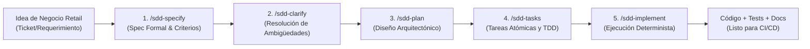

# Guía Práctica de Sesión 1: Desarrollo con IA & SDD (Specification-Driven Development)

**Duración:** 60 Minutos (09:00 - 10:00)  
**Audiencia:** Tech Leads, Desarrolladores Backend/Frontend, Arquitectos de Software de Retail Enterprise  
**Instructor:** Felipe Andrés Velásquez Castro (AI Architecture Lead, Axmos)  
**Insumos Base:**
- Repositorio SDD Skill: [github.com/develasquez/sdd-skill](https://github.com/develasquez/sdd-skill)
- Presentación Gravi & Antigravity: [Google Slides Antigravity](https://docs.google.com/presentation/d/17ZVpe-sGWTjUsyu3_DcUV15sXWfiJfAxdp6w8KNHay0/edit)
- Repositorio Frontend: [github.com/develasquez/gcp-front-end-example](https://github.com/develasquez/gcp-front-end-example)
- Paquete Arquitectónico: [vanilla-core-ui en npm](https://www.npmjs.com/package/vanilla-core-ui)

---

## 1. Objetivos de Aprendizaje

Al finalizar la primera hora del workshop, el equipo técnico de Retail Enterprise será capaz de:
1. **Diferenciar el desarrollo asistido por IA reactivo ("vibe coding") del desarrollo determinista guiado por especificaciones (SDD - Specification-Driven Development).**
2. **Dominar el ciclo de vida de especificación formal en Antigravity:** `/sdd-specify` $\to$ `/sdd-clarify` $\to$ `/sdd-plan` $\to$ `/sdd-tasks` $\to$ `/sdd-implement`.
3. **Estructurar la gobernanza de agentes con `AGENTS.md` y `SKILL.md`**, garantizando que Antigravity actúe como un Tech Lead autónomo que no inventa requisitos ni rompe contratos de API.
4. **Configurar servidores MCP (Model Context Protocol) en modo sólo lectura** (PostgreSQL, Jira, GitHub) para enriquecer el contexto del agente sin comprometer datos de producción.
5. **Generar pruebas unitarias y de integración automáticas** derivadas matemáticamente de la especificación antes de escribir una sola línea de código de negocio.

---

## 2. Marco Conceptual: Por qué SDD en 2026



### La Trampa del "Prompt Caótico" vs. SDD
En 2026, los LLMs son capaces de generar miles de líneas de código en segundos. Sin embargo, en arquitecturas empresariales como las de Retail Enterprise (con cientos de tiendas, alta concurrencia y tolerancia cero a fallas de inventario), programar a base de prompts libres introduce:
- **Alucinaciones arquitectónicas:** Métodos inventados, librerías deprecadas, contratos de datos rotos.
- **Deuda técnica oculta:** Código que "parece funcionar" pero carece de validaciones de frontera o manejo de errores de concurrencia.
- **Falta de trazabilidad:** Ningún miembro del equipo sabe qué criterios de negocio exactos rigen la lógica generada.

**La Solución SDD de Felipe Velásquez (`sdd-skill`):**  
Invertir el paradigma. La especificación formal en Markdown (`spec.md`) es el código fuente fundamental; el código TypeScript o Go es una consecuencia determinista de dicha especificación.

---

## 3. Arquitectura del Agente Antigravity: De "Intern" a "Tech Lead"

Basado en la experiencia documentada en la presentación *¡Bienvenido, Gravi!*:

| Nivel de Madurez | Modo de Operación | Supervisión Humana | Riesgo Arquitectónico |
| :--- | :--- | :--- | :--- |
| **Gravi Intern (Junior)** | Prompting ad-hoc, edición directa en chat | 100% revisión línea a línea | Alto (deriva de estilo, alucinaciones) |
| **Gravi Mid-Level** | Uso de Skills específicos (`sdd-skill`) | Validación de planes antes de implementar | Medio (control de dependencias) |
| **Gravi Tech Lead (Autónomo)** | Orquestación multi-agente, `AGENTS.md` estricto, MCPs conectados, validación CI local | Revisión de Pull Requests y Especificaciones | Mínimo (determinismo guiado por reglas) |

### Gobernanza con `AGENTS.md`
En la raíz de cada proyecto de Retail debe residir un archivo `AGENTS.md` que impone las restricciones inviolables para Antigravity:
```markdown
# AGENTS.md - Reglas para Retail Enterprise

## 1. Convenciones de Código
- Lenguaje: TypeScript 5.x estricto (strict: true, noImplicitAny: true).
- Runtime: Node.js 20 LTS en contenedor Alpine.
- Arquitectura: Clean Architecture (Domain, UseCases, Infrastructure, Interfaces).

## 2. Restricciones No Negociables
- No usar librerías externas para utilidades básicas que resuelva la stdlib.
- Toda API debe validar schemas mediante Zod o interfaces estrictas OpenAPI 3.0.
- Prohibido hacer hardcode de variables de entorno o credenciales.
- Logs exclusivamente en formato JSON estructurado compatible con Cloud Logging.
```

---

## 4. Laboratorio Hands-on Paso a Paso (40 minutos)

### Contexto de Negocio
Vamos a construir y especificar el microservicio **`retail-inventory-service`**:
- Consulta de existencias por código EAN y ID de tienda.
- Validación de stock crítico (< 10 unidades emite alerta estructurada).
- Endpoint REST seguro documentado en OpenAPI 3.0.

---

### Paso 1: Inicialización del Entorno con Antigravity CLI y SDD Skill
Desde la terminal, el desarrollador activa el skill oficial de Felipe Velásquez:

```bash
# 1. Clonar e inicializar el skill en el workspace
git clone https://github.com/develasquez/sdd-skill.git .gemini/skills/sdd-skill

# 2. Verificar la disponibilidad de comandos SDD
# En Antigravity CLI ejecutar:
/sdd-help
```

*Salida esperada:* Lista de los 10 comandos de ciclo de vida (`/sdd-specify`, `/sdd-clarify`, `/sdd-plan`, `/sdd-tasks`, `/sdd-implement`, `/sdd-analyze`, etc.).

---

### Paso 2: Ejecución de `/sdd-specify` (Especificación Formal)
El desarrollador introduce el requerimiento preliminar:

```markdown
/sdd-specify Diseñar el microservicio de consulta y reserva de inventario para Retail Enterprise.
Requisitos:
- Buscar disponibilidad de producto por SKU/EAN y StoreID.
- Soporte para transacciones concurrentes de reserva sin sobreventa.
- Integración con base de datos Cloud SQL PostgreSQL con pool de conexiones optimizado.
- Respuestas con latencia p99 < 50ms.
```

**Resultado generado por Antigravity (`spec.md`):**
- Modelo de entidades: `InventoryItem`, `Store`, `StockMovement`.
- Criterios de Aceptación en formato Gherkin (Given-When-Then).
- Definición de errores HTTP: `404 Not Found`, `409 Conflict` (en sobreventa), `422 Unprocessable Entity`.

---

### Paso 3: Resolución de Ambigüedades con `/sdd-clarify`
El agente interroga activamente al ingeniero de Retail sobre decisiones críticas de arquitectura:
- *¿Qué estrategia de concurrencia se debe emplear en Cloud SQL? (Optimistic Locking con versión vs. SELECT FOR UPDATE)*
- *¿Cuál es la política de caché para productos de alta rotación (leche, pan, huevos)?*

**Respuesta guiada del desarrollador:**
```text
Usar Pessimistic Locking (SELECT FOR UPDATE) con timeout de 2 segundos para reservas críticas.
Para consultas de sólo lectura, admitir réplicas de lectura de Cloud SQL con TTL de caché de 15 segundos.
```

---

### Paso 4: Generación del Plan y Tareas (`/sdd-plan` & `/sdd-tasks`)
Antigravity genera:
1. `plan.md`: Diagrama de componentes, contratos de interfaces de Clean Architecture.
2. `tasks.md`: Lista jerárquica de tareas atómicas numeradas, priorizando TDD (Test-Driven Development):
   - `[T-01]` Definir contratos TypeScript de Dominio y Value Objects.
   - `[T-02]` Escribir pruebas unitarias de casos de uso (Mocha/Jest/Vitest).
   - `[T-03]` Implementar lógica de caso de uso `ReserveStockUseCase`.
   - `[T-04]` Implementar repositorio PostgreSQL con transacciones atómicas.
   - `[T-05]` Exponer controlador REST Express con validación de schema.

---

### Paso 5: Implementación Determinista con `/sdd-implement`
Antigravity ejecuta las tareas secuencialmente, escribiendo primero los tests unitarios:

```typescript
// test/unit/reserve-stock.use-case.spec.ts
import { describe, it, expect, vi } from 'vitest';
import { ReserveStockUseCase } from '../../src/domain/use-cases/reserve-stock.use-case';
import { InventoryRepository } from '../../src/domain/repositories/inventory.repository';

describe('ReserveStockUseCase (Retail Enterprise)', () => {
  it('debe rechazar la reserva con 409 Conflict si la cantidad solicitada supera el stock disponible', async () => {
    const mockRepo: InventoryRepository = {
      findBySkuAndStore: vi.fn().mockResolvedValue({ sku: 'EAN7701234', storeId: 'TIENDA_BOG_102', stock: 5 }),
      updateStock: vi.fn(),
    };
    const useCase = new ReserveStockUseCase(mockRepo);
    
    await expect(useCase.execute({ sku: 'EAN7701234', storeId: 'TIENDA_BOG_102', quantity: 10 }))
      .rejects.toThrow('STOCK_INSUFICIENTE_CONFLICT');
  });
});
```

Una vez que los tests fallan de forma controlada (fase Roja de TDD), Antigravity genera el código de dominio que hace pasar las pruebas al 100%.

---

## 5. Front-end Moderno con Vanilla-Core y Material Design

Para los portales administrativos y dashboards de operadores en Retail Enterprise, exploramos el paquete `vanilla-core-ui`:
- **Single Source of Truth (`store.js`):** El estado de la tienda (sesión del cajero, productos escaneados, total) vive en un solo objeto inmutable.
- **Renderizado Quirúrgico (Anti-Thrashing):** La interfaz nunca hace `innerHTML = ...` sobre contenedores con inputs activos, evitando perder el foco mientras el operador digita el código de barras.
- **Tokens Material You (M3):** Integración nativa con la paleta de colores de Retail (rojo institucional, superficies neutras, contraste WCAG AAA).

---

## 6. Checklist de Verificación para el Tech Lead (Fin de Sesión)

- [ ] ¿Existe un archivo `spec.md` con criterios de aceptación claros antes del código?
- [ ] ¿Se cuenta con un archivo `AGENTS.md` en la raíz del repositorio que rige el comportamiento de Antigravity?
- [ ] ¿Todos los tests unitarios generados por el agente pasan localmente sin advertencias?
- [ ] ¿Se evitó el uso de dependencias externas innecesarias respetando los principios de minimalismo y rendimiento?
