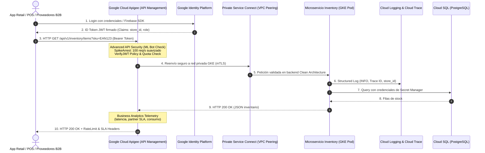
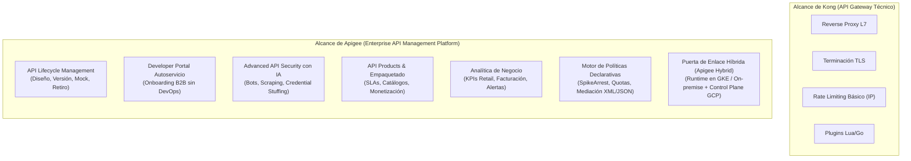

# Guía Práctica de Sesión 2: Gestión y Seguridad de APIs en GCP

**Duración:** 60 Minutos (10:00 - 11:00)  
**Audiencia:** Tech Leads, Desarrolladores Backend, Arquitectos de Seguridad de Retail Enterprise  
**Instructor:** Felipe Andrés Velásquez Castro (AI Architecture Lead, Axmos)  
**Insumos Base:**
- Repositorio Backend GCP: [github.com/develasquez/gcp-back-end-example](https://github.com/develasquez/gcp-back-end-example)
- Repositorio Logs Estructurados: [github.com/develasquez/google-cloud-structured-logs](https://github.com/develasquez/google-cloud-structured-logs)
- Repositorio Setup GCP: [github.com/develasquez/gcp-setup-example](https://github.com/develasquez/gcp-setup-example)

---

## 1. Objetivos de Aprendizaje

Al finalizar esta sesión, el equipo de Retail Enterprise dominará:
1. **Diferenciar con precisión arquitectónica un simple API Gateway (como Kong) de una plataforma de API Management empresarial (como Google Cloud Apigee)**, entendiendo por qué el crecimiento de Retail Enterprise requiere gobernanza de ciclo de vida completo, Developer Portal, analítica de negocio y seguridad basada en Machine Learning.
2. **Publicar APIs autodocumentadas bajo el estándar OpenAPI 3.0 (Swagger)** integradas de forma nativa en Clean Architecture con TypeScript.
3. **Implementar autenticación y autorización Zero-Trust mediante Google Identity Platform y Apigee**, validando tokens JWT Bearer y decodificando claims de rol (`store_supervisor`, `cashier`, `inventory_admin`).
4. **Diseñar e implementar políticas avanzadas de tráfico en Apigee (Spike Arrest vs. Quota Management)** y rate limiting a nivel de backend para blindar los microservicios de Retail contra saturación y DDoS.
5. **Implementar Observabilidad de Nivel Empresarial con Cloud Logging y Cloud Trace**, utilizando el formato JSON nativo de GCP para rastrear la latencia de cada transacción y correlacionar peticiones distribuidas.
6. **Gestionar secretos de forma segura con Google Secret Manager**, eliminando credenciales en plano o en variables de entorno de build.

---

## 2. Diagrama de Arquitectura Empresarial con Apigee en GCP



---

## 3. Arquitectura Estratégica: Google Cloud Apigee vs. Kong API Gateway

Para una cadena de retail de escala nacional como **Retail Enterprise** (con miles de puntos de venta físicos, terminales POS, aplicaciones de domicilios, proveedores logísticos y banca aliada), la decisión entre un **API Gateway** y una **Plataforma Integral de API Management** define la estabilidad y escalabilidad del negocio.

### A. La Brecha Conceptual: Gateway Técnico vs. API Management Empresarial



- **Kong (API Gateway):** Es un componente de infraestructura de red a nivel de capa 7 (construido sobre NGINX/Envoy). Su foco es puramente técnico: *¿cómo enruto un paquete HTTP del cliente A al microservicio B?*. Carece de herramientas nativas para gobernanza corporativa, empaquetado de productos, autoservicio de proveedores o detección de anomalías por Machine Learning.
- **Google Cloud Apigee:** Es una plataforma de gestión integral orientada al negocio. Trata a las APIs como **Productos Digitales**. Proporciona el ecosistema completo para diseñar, asegurar, gobernar, publicar y monetizar interfaces entre los sistemas de Retail y sus consumidores (internos y externos).

---

### B. Matriz Comparativa: Apigee (X/Hybrid) vs. Kong Gateway

| Dimensión Técnica y de Negocio | Kong (API Gateway) | Google Cloud Apigee (API Manager) | Impacto Crítico para Retail Enterprise |
| :--- | :--- | :--- | :--- |
| **Gobernanza y Ciclo de Vida** | Manual (requiere orquestación externa en CI/CD y plugins de terceros). | Ciclo completo nativo: Diseño OpenAPI, validación semántica, versionamiento, deprecación ordenada. | Auditoría y control de cambios sobre APIs críticas (Precios, Inventario, Nómina). |
| **Portal de Desarrolladores** | Básico o dependiente de licencias Enterprise de alto costo con configuración ad-hoc. | **Developer Portal integrado de autoservicio** con gestión de credenciales, roles RBAC y documentación interactiva. | Los proveedores y aliados logísticos de Retail se autoservician llaves de API sin generar tickets a DevOps. |
| **Seguridad con IA (Advanced API Security)** | Reglas estáticas WAF y rate limits por IP. Vulnerable a bots distribuidos. | **Modelos de Machine Learning entrenados por Google** que detectan abuso, *scraping* masivo de precios, y *credential stuffing*. | Protección del catálogo de precios de Retail frente a competidores y bots de extracción. |
| **Control de Tráfico Granular** | Rate limiting simple basado en contadores en Redis. | **Separación nativa de `SpikeArrest` vs. `Quota`:** suavizado milisegundo a milisegundo anti-shock + cuotas contractuales. | Evita caídas en cadena (*cascading failures*) en cajas POS durante promociones masivas (Black Friday, Días de Alta Promoción). |
| **Empaquetado de APIs (API Products)** | No disponible de forma nativa. Solo mapeo URL $\to$ Upstream. | Creación de **API Products** que agrupan recursos de múltiples microservicios con cuotas y SLAs específicos. | Permite ofrecer una "API de Proveedores" con cuota de 50.000 req/mes y una "API de Cajas POS" ilimitada y prioritaria. |
| **Mediación y Transformación** | Limitado a plugins de reescritura de cabeceras o scripts Lua complejos. | **Motor de Políticas Out-of-the-Box:** Transformación bidireccional XML $\leftrightarrow$ JSON, validación JSON Schema, SOAP $\to$ REST. | Interconexión inmediata con el ERP central heredado (SAP / AS400) sin reescribir microservicios en GKE. |
| **Analítica y Métricas** | Métricas de red y transporte (códigos HTTP 200/500, latencias en Prometheus). | **Business Analytics:** Métricas de negocio correlacionadas (volumen transaccional por tienda, errores por tipo de producto, SLAs B2B). | Los gerentes de operaciones y tecnología ven en tiempo real el comportamiento comercial de las APIs. |
| **Arquitectura Híbrida** | Kong Gateway local/K8s. | **Apigee Hybrid:** El plano de datos (runtime) corre en GKE privado o en datacenters de Retail; el plano de control y analítica vive administrado en GCP. | Cumplimiento estricto de latencia ultrabaja en tiendas y soberanía de datos locales. |

---

### C. Políticas Declarativas de Apigee para Retail Enterprise (Snippets XML de Producción)

Apigee desacopla la seguridad de la lógica de código mediante políticas declarativas configurables en el proxy:

#### 1. Protección Anti-Shock con `SpikeArrest` (Previene caídas en microservicios)
A diferencia de un rate limiter tradicional que permite 100 peticiones en el segundo 1 y bloquea los 59 segundos restantes, `SpikeArrest` suaviza el tráfico microsegundo a microsegundo:

```xml
<!-- /apiproxy/policies/SA-ProtectBackend.xml -->
<SpikeArrest async="false" continueOnError="false" enabled="true" name="SA-ProtectBackend">
    <DisplayName>Spike Arrest - Suavizado de Tráfico</DisplayName>
    <!-- Máximo 120 peticiones por segundo por IP/Sucursal -->
    <Rate>120ps</Rate>
    <!-- Usar la IP del POS o Store-ID como llave de suavizado -->
    <Identifier ref="request.header.X-Store-Id"/>
</SpikeArrest>
```

#### 2. Validación Nativa de Tokens con `VerifyJWT`
Descarga criptográfica de la validación del token antes de que la petición toque los clústeres de GKE:

```xml
<!-- /apiproxy/policies/JWT-VerifyIdentityToken.xml -->
<VerifyJWT async="false" continueOnError="false" enabled="true" name="JWT-VerifyIdentityToken">
    <DisplayName>Verificar JWT Google Identity Platform</DisplayName>
    <Algorithm>RS256</Algorithm>
    <Source>request.header.Authorization</Source>
    <PublicKey>
        <!-- Clave pública oficial de Google Identity Platform / Firebase -->
        <JWKS uri="https://www.googleapis.com/service_accounts/v1/jwk/securetoken@system.gserviceaccount.com"/>
    </PublicKey>
    <Issuer>https://securetoken.google.com/retail-enterprise-prod</Issuer>
    <Audience>retail-enterprise-prod</Audience>
    <AdditionalClaims>
        <!-- Requerir obligatoriamente el claim del rol del usuario -->
        <Claim name="role" type="string"/>
    </AdditionalClaims>
</VerifyJWT>
```

#### 3. Cuotas de Negocio por Producto con `Quota`
Aplica límites contractuales diferenciados según el API Product contratado por el aliado comercial:

```xml
<!-- /apiproxy/policies/QU-TieredAllowance.xml -->
<Quota async="false" continueOnError="false" enabled="true" name="QU-TieredAllowance">
    <DisplayName>Cuota de Negocio Mensual</DisplayName>
    <Interval>1</Interval>
    <TimeUnit>month</TimeUnit>
    <!-- La cuota se extrae dinámicamente del API Product asignado a la Developer App -->
    <Allow countRef="verifyapikey.verify-api-key.apiproduct.developer.quota.limit" count="10000"/>
    <Identifier ref="verifyapikey.verify-api-key.client_id"/>
    <Distributed>true</Distributed>
    <Synchronous>false</Synchronous>
</Quota>
```

---

## 4. Componentes Fundamentales de Implementación en Código Base

### A. Documentación Viva con OpenAPI 3.0 / Swagger
En `gcp-back-end-example`, cada endpoint está estrictamente tipado y documentado mediante anotaciones JSDoc/Swagger que generan automáticamente la especificación OpenAPI en `/api-docs`:

```typescript
/**
 * @openapi
 * /api/v1/inventory/{sku}:
 *   get:
 *     summary: Obtener existencias de un producto por SKU y Tienda
 *     tags:
 *       - Inventario
 *     security:
 *       - BearerAuth: []
 *     parameters:
 *       - in: path
 *         name: sku
 *         required: true
 *         schema:
 *           type: string
 *           example: "7701234567890"
 *       - in: header
 *         name: X-Store-Id
 *         required: true
 *         schema:
 *           type: string
 *           example: "BOG-USAQUEN-042"
 *     responses:
 *       200:
 *         description: Stock actual devuelto con éxito
 *       401:
 *         description: Token no provisto o inválido
 *       429:
 *         description: Cuota de peticiones excedida
 */
```

---

### B. Autenticación con Google Identity Platform
El middleware de autenticación valida el token criptográfico emitido por Google Identity Platform sin necesidad de llamar a la base de datos de usuarios en cada petición:

```typescript
// src/interfaces/http/middlewares/auth.middleware.ts
import { Request, Response, NextFunction } from 'express';
import * as admin from 'firebase-admin';

// Inicialización de la instancia de Firebase/Identity Platform Admin
if (!admin.apps.length) {
  admin.initializeApp();
}

export interface AuthenticatedRequest extends Request {
  user?: admin.auth.DecodedIdToken;
}

export async function authenticateIdentityToken(
  req: AuthenticatedRequest,
  res: Response,
  next: NextFunction
): Promise<void> {
  const authHeader = req.headers.authorization;
  if (!authHeader || !authHeader.startsWith('Bearer ')) {
    res.status(401).json({
      error: 'UNAUTHORIZED',
      message: 'Cabecera Authorization requerida con formato: Bearer <token>',
    });
    return;
  }

  const token = authHeader.split('Bearer ')[1].trim();

  try {
    // Verificación criptográfica con los certificados públicos de Google
    const decodedToken = await admin.auth().verifyIdToken(token, true);
    req.user = decodedToken;
    next();
  } catch (error: any) {
    res.status(401).json({
      error: 'INVALID_TOKEN',
      message: 'El token proporcionado ha expirado o es inválido',
      details: error.code,
    });
  }
}
```

---

### C. Rate Limiting de Alto Rendimiento
Para evitar que un POS desconectado o un script masivo sature el catálogo central, implementamos rate-limiting por IP y por identificador de tienda:

```typescript
// src/interfaces/http/middlewares/rate-limit.middleware.ts
import rateLimit from 'express-rate-limit';

export const inventoryRateLimiter = rateLimit({
  windowMs: 60 * 1000, // Ventana de 1 minuto
  max: 120, // Máximo 120 peticiones por minuto por IP
  standardHeaders: true, // Devuelve cabeceras RateLimit-* estándar RFC
  legacyHeaders: false,
  message: {
    status: 429,
    error: 'TOO_MANY_REQUESTS',
    message: 'Límite de peticiones excedido para la tienda. Intente nuevamente en 60 segundos.',
  },
});
```

---

### D. Observabilidad de Nivel Producción con `google-cloud-structured-logs`
Los logs en texto plano son el enemigo de la depuración en producción. Usando el paquete `google-cloud-structured-logs`, cada log emitido por la app es un objeto JSON enriquecido con las claves canónicas de Google Cloud:

```typescript
// src/infrastructure/logging/gcp-logger.ts
import { Logger } from 'google-cloud-structured-logs';

const PROJECT_ID = process.env.GOOGLE_CLOUD_PROJECT || 'retail-enterprise-prod';

export function createRequestLogger(req: any) {
  // Extraer el trace de Google Cloud pasado por Cloud Load Balancing o API Gateway
  const traceHeader = req.header('X-Cloud-Trace-Context');
  let trace = undefined;
  if (traceHeader && PROJECT_ID) {
    const [traceId] = traceHeader.split('/');
    trace = `projects/${PROJECT_ID}/traces/${traceId}`;
  }

  return {
    info: (message: string, context: Record<string, any> = {}) => {
      console.log(
        JSON.stringify({
          severity: 'INFO',
          message,
          'logging.googleapis.com/trace': trace,
          timestamp: new Date().toISOString(),
          httpRequest: {
            requestMethod: req.method,
            requestUrl: req.originalUrl,
            userAgent: req.get('user-agent'),
            remoteIp: req.ip,
          },
          ...context,
        })
      );
    },
    error: (message: string, error: any, context: Record<string, any> = {}) => {
      console.error(
        JSON.stringify({
          severity: 'ERROR',
          message,
          'logging.googleapis.com/trace': trace,
          timestamp: new Date().toISOString(),
          errorStack: error.stack,
          ...context,
        })
      );
    },
  };
}
```

---

## 5. Laboratorio Hands-on Paso a Paso (40 minutos)

### Paso 1: Configurar el Repositorio Base
```bash
git clone https://github.com/develasquez/gcp-back-end-example.git retail-backend
cd retail-backend
npm install
```

### Paso 2: Inyectar Secretos de Cloud Secret Manager
Demostramos el script de aprovisionamiento de `gcp-setup-example`:
```bash
# Crear el secreto en Secret Manager para la base de datos de Retail Enterprise
gcloud secrets create retail-db-credentials \
    --replication-policy="automatic" \
    --data-file="<(echo -n '{\"user\":\"postgres\",\"password\":\"SuperSecretRetail_2026\",\"host\":\"10.128.0.5\"}')"
```

En la aplicación, se consume el secreto en el arranque sin persistirlo en disco:
```typescript
import { SecretManagerServiceClient } from '@google-cloud/secret-manager';

const client = new SecretManagerServiceClient();

export async function getDatabaseCredentials(): Promise<{ user: string; pass: string; host: string }> {
  const [version] = await client.accessSecretVersion({
    name: 'projects/retail-enterprise-prod/secrets/retail-db-credentials/versions/latest',
  });
  const payload = version.payload?.data?.toString() || '{}';
  return JSON.parse(payload);
}
```

### Paso 3: Probar la Documentación Swagger en Vivo
Arrancar el servidor localmente:
```bash
npm run dev
```
Abrir el navegador en `http://localhost:8080/api-docs` para interactuar con los esquemas de validación y probar la autorización con token JWT Bearer.

---

## 6. Checklist de Verificación para el Tech Lead (Fin de Sesión)

- [ ] ¿Se comprende con claridad la distinción estratégica entre un simple gateway técnico (Kong) y una plataforma de API Management (Google Cloud Apigee)?
- [ ] ¿Están definidas las políticas de `SpikeArrest` y `Quota` para evitar saturación de los microservicios en GKE?
- [ ] ¿Todos los endpoints de la API cuentan con especificación OpenAPI 3.0 actualizada y viva?
- [ ] ¿El middleware rechaza peticiones no autenticadas con código HTTP 401 estructurado?
- [ ] ¿Se aplica Rate Limiting preventivo antes de golpear la base de datos relacional?
- [ ] ¿Los logs se emiten en formato JSON con la clave `logging.googleapis.com/trace` para correlación en Cloud Trace?
- [ ] ¿Ninguna contraseña o llave de API reside en el código ni en el `Dockerfile`?
