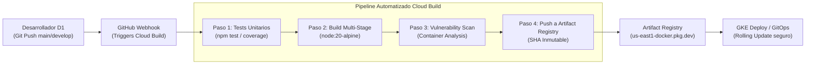

# Guía Práctica de Sesión 3: DevOps en GCP con Cloud Build y Artifact Registry

**Duración:** 60 Minutos (11:00 - 12:00)  
**Audiencia:** Tech Leads, Ingenieros DevOps, Desarrolladores Backend/Frontend de Tiendas D1  
**Instructor:** Felipe Andrés Velásquez Castro (AI Architecture Lead, Axmos)  
**Insumos Base:**
- Repositorio Backend GCP: [github.com/develasquez/gcp-back-end-example](https://github.com/develasquez/gcp-back-end-example) (Dockerfile & cloudbuild.yaml)
- Repositorio Frontend GCP: [github.com/develasquez/gcp-front-end-example](https://github.com/develasquez/gcp-front-end-example) (Dockerfile & cloudbuild.yaml)
- Repositorio Setup GCP: [github.com/develasquez/gcp-setup-example](https://github.com/develasquez/gcp-setup-example) (Provisioning scripts)

---

## 1. Objetivos de Aprendizaje

Al finalizar esta sesión, el equipo de Tiendas D1 dominará:
1. **Construir imágenes OCI hiperoptimizadas y seguras mediante Dockerfiles Multi-Stage**, reduciendo el tamaño de la imagen final en más del 80% y eliminando compiladores/herramientas de build en el runtime.
2. **Eliminar los riesgos de ejecución con privilegios de root**, configurando usuarios de sistema sin privilegios (`USER node` / `USER 10001`) y sistemas de archivos de sólo lectura.
3. **Orquestar pipelines de integración y entrega continua (CI/CD) con Cloud Build**, ejecutando tests automatizados, builds paralelos y análisis de calidad antes de generar artefactos.
4. **Gestionar registros privados con Artifact Registry**, configurando inmutabilidad de etiquetas, escaneo automático de vulnerabilidades (Container Analysis) y políticas de retención.
5. **Alinear la estrategia de despliegue con GitOps**, utilizando hashes criptográficos de Git (`$SHORT_SHA`) para garantizar trazabilidad absoluta entre el commit y el Pod en producción.

---

## 2. Flujo del Pipeline CI/CD en Google Cloud



---

## 3. Anatomía de un Dockerfile Multi-Stage de Producción

En `gcp-back-end-example`, Felipe Velásquez implementa el patrón de dos etapas para separar de manera tajante el entorno de compilación del artefacto de ejecución:

```dockerfile
# ==========================================
# Etapa 1: Builder (Compilación y dependencias de build)
# ==========================================
FROM node:20-alpine AS builder

WORKDIR /usr/src/app

# Copiar manifiestos de dependencias primero (Aprovechar caché de capas Docker)
COPY package*.json tsconfig.json ./

# Instalar todas las dependencias (incluyendo devDependencies para compilar TS)
RUN npm ci

# Copiar el código fuente
COPY src/ ./src

# Compilar TypeScript a JavaScript optimizado en /dist
RUN npm run build

# Eliminar dependencias de desarrollo para dejar solo las de producción
RUN npm prune --production

# ==========================================
# Etapa 2: Runtime (Imagen final de producción, ultraligera)
# ==========================================
FROM node:20-alpine AS runner

WORKDIR /usr/src/app

ENV NODE_ENV=production
ENV PORT=8080

# Seguridad: Ejecutar como usuario no-root 'node' (UID/GID 1000)
USER node

# Copiar dependencias de producción limpias desde la etapa builder
COPY --chown=node:node --from=builder /usr/src/app/node_modules ./node_modules

# Copiar el código compilado desde la etapa builder
COPY --chown=node:node --from=builder /usr/src/app/dist ./dist
COPY --chown=node:node package*.json ./

# Exponer el puerto de la aplicación
EXPOSE 8080

# Comando de arranque sin pasar por npm para manejar señales UNIX (SIGTERM/SIGINT) limpiamente
CMD ["node", "dist/index.js"]
```

### Por qué esta arquitectura marca la diferencia para D1:
- **Reducción de Superficie de Ataque:** No existen herramientas como `npm`, `git`, `python`, ni `gcc` en la imagen final. Si un atacante compromete la aplicación, no tiene compiladores para descargar ni armar exploits en memoria.
- **Tamaño de Imagen:** Una imagen típica `node:20` estándar pesa ~1.1 GB. Esta imagen en Alpine pesa ~90 MB, acelerando el arranque en frío (*cold start*) de los Pods en GKE de 45 segundos a menos de 4 segundos.

---

## 4. Pipeline de CI/CD Declarativo: `cloudbuild.yaml`

El archivo de configuración de Cloud Build orquesta todo el proceso sin necesidad de mantener servidores Jenkins o GitLab runners dedicados:

```yaml
# cloudbuild.yaml (Producción Tiendas D1)
steps:
  # -------------------------------------------------------------
  # Paso 1: Ejecutar Pruebas Unitarias y Validación de Calidad
  # -------------------------------------------------------------
  - name: 'node:20-alpine'
    id: 'unit-tests'
    entrypoint: 'sh'
    args:
      - '-c'
      - |
        npm ci
        npm test

  # -------------------------------------------------------------
  # Paso 2: Compilación y Empaquetado Docker con BuildKit
  # -------------------------------------------------------------
  - name: 'gcr.io/cloud-builders/docker'
    id: 'build-image'
    args:
      - 'build'
      - '-t'
      - '$_LOCATION-docker.pkg.dev/$PROJECT_ID/$_REPOSITORY/$_IMAGE_NAME:$SHORT_SHA'
      - '-t'
      - '$_LOCATION-docker.pkg.dev/$PROJECT_ID/$_REPOSITORY/$_IMAGE_NAME:latest'
      - '--cache-from'
      - '$_LOCATION-docker.pkg.dev/$PROJECT_ID/$_REPOSITORY/$_IMAGE_NAME:latest'
      - '.'
    env:
      - 'DOCKER_BUILDKIT=1'

  # -------------------------------------------------------------
  # Paso 3: Publicación en Artifact Registry Privado
  # -------------------------------------------------------------
  - name: 'gcr.io/cloud-builders/docker'
    id: 'push-image'
    args:
      - 'push'
      - '--all-tags'
      - '$_LOCATION-docker.pkg.dev/$PROJECT_ID/$_REPOSITORY/$_IMAGE_NAME'

# Variables de sustitución parametrizadas
substitutions:
  _LOCATION: 'us-east1'
  _REPOSITORY: 'd1-apps'
  _IMAGE_NAME: 'inventory-service'

# Configuración de recursos de compilación para alta velocidad
options:
  machineType: 'E2_HIGHCPU_8'
  logging: CLOUD_LOGGING_ONLY

# Almacenar el resumen del build
images:
  - '$_LOCATION-docker.pkg.dev/$PROJECT_ID/$_REPOSITORY/$_IMAGE_NAME:$SHORT_SHA'
```

---

## 5. Laboratorio Hands-on Paso a Paso (40 minutos)

### Paso 1: Aprovisionar el Repositorio en Artifact Registry
Utilizando la CLI de GCP (`gcloud`):
```bash
# Habilitar las APIs necesarias
gcloud services enable \
    artifactregistry.googleapis.com \
    cloudbuild.googleapis.com \
    containerscanning.googleapis.com

# Crear el repositorio privado regional en us-east1
gcloud artifacts repositories create d1-apps \
    --repository-format=docker \
    --location=us-east1 \
    --description="Repositorio Docker de Microservicios Tiendas D1" \
    --immutable-tags
```
> **Nota de Seguridad:** El flag `--immutable-tags` impide que un tag publicado (como `v1.0.4` o `$SHORT_SHA`) sea sobreescrito maliciosamente o por error humano.

---

### Paso 2: Configurar Permisos IAM para el Service Account de Cloud Build
El Service Account de Cloud Build requiere permisos de sólo escritura en Artifact Registry:
```bash
PROJECT_NUMBER=$(gcloud projects describe $(gcloud config get-value project) --format='value(projectNumber)')

gcloud projects add-iam-policy-binding $(gcloud config get-value project) \
    --member="serviceAccount:${PROJECT_NUMBER}@cloudbuild.gserviceaccount.com" \
    --role="roles/artifactregistry.writer"
```

---

### Paso 3: Ejecutar el Build y Validar el Escaneo de Vulnerabilidades
Lanzar la compilación desde el workspace local:
```bash
gcloud builds submit --config=cloudbuild.yaml .
```

Una vez finalizado, inspeccionamos el escaneo automático de vulnerabilidades (CVEs):
```bash
gcloud artifacts docker images list-vulnerabilities \
    us-east1-docker.pkg.dev/$(gcloud config get-value project)/d1-apps/inventory-service:$SHORT_SHA
```

---

## 6. Checklist de Verificación para el Tech Lead (Fin de Sesión)

- [ ] ¿El `Dockerfile` final utiliza una imagen base Alpine/Distroless y ejecuta bajo un usuario no-root?
- [ ] ¿El pipeline de Cloud Build falla inmediatamente si los tests unitarios o el linter no pasan?
- [ ] ¿Las imágenes se etiquetan obligatoriamente con el `$SHORT_SHA` del commit de Git y no exclusivamente con `latest`?
- [ ] ¿El repositorio de Artifact Registry tiene activado el escaneo automático de vulnerabilidades (Container Analysis)?
- [ ] ¿Se cuenta con un `.dockerignore` estricto que excluye `node_modules`, `.git`, `.env` y credenciales locales?
