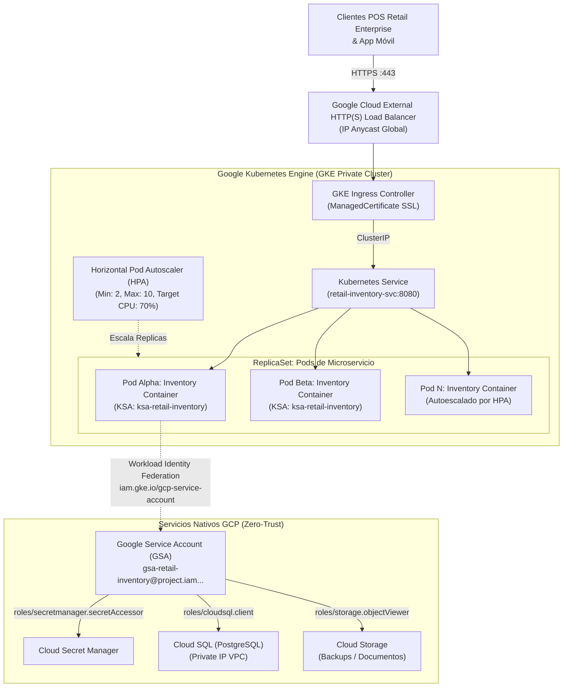

# Guía Práctica de Sesión 4: Kubernetes en Producción en Google Kubernetes Engine (GKE)

**Duración:** 60 Minutos (12:00 - 13:00)  
**Audiencia:** Tech Leads, Ingenieros DevOps/SRE, Desarrolladores Backend, Arquitectos Cloud de Retail Enterprise  
**Instructor:** Felipe Andrés Velásquez Castro (AI Architecture Lead, Axmos)  
**Insumos Base:**
- Repositorio Workload Identity: [github.com/develasquez/workload-identity-gke](https://github.com/develasquez/workload-identity-gke)
- Repositorio Nivelación K8s: [github.com/develasquez/nivelacion-kubernetes](https://github.com/develasquez/nivelacion-kubernetes)
- Presentación Sé el Rey de los Piratas: [Google Slides Kubernetes](https://docs.google.com/presentation/d/1z1AW6JPWl381OLqKR2f9Sr8_lVQiufjjzWbEsK5pZMM/edit)
- Repositorio Clúster Privado GKE: [github.com/develasquez/gke-private-cluster](https://github.com/develasquez/gke-private-cluster)
- Repositorio Multi-Cluster Ingress: [github.com/develasquez/multi-cluster-ingress](https://github.com/develasquez/multi-cluster-ingress)
- Artículo LinkedIn: [Introducción a Kubernetes](https://www.linkedin.com/pulse/introducci%C3%B3n-kubernetes-felipe-andres-velasquez-castro/)

---

## 1. Objetivos de Aprendizaje

Al finalizar la última hora del workshop, el equipo técnico de Retail Enterprise será capaz de:
1. **Comprender la evolución arquitectónica desde servidores físicos y VMs hasta la orquestación distribuida con Kubernetes en GKE.**
2. **Diseñar manifiestos declarativos de producción con resiliencia de grado industrial:** `Deployment` con sondas *liveness* y *readiness*, límites y reservas estrictas de CPU/Memoria (`requests` y `limits`), y estrategias de *RollingUpdate* con cero tiempo fuera de servicio (*Zero-Downtime*).
3. **Erradicar de raíz las llaves de cuentas de servicio en formato JSON mediante GKE Workload Identity**, vinculando de forma criptográfica un *Kubernetes Service Account* (KSA) con un *Google Cloud Service Account* (GSA).
4. **Exponer servicios de forma segura y global mediante GKE Ingress**, configurando certificados SSL administrados automáticamente por Google (`ManagedCertificate`) y políticas de seguridad perimetral.
5. **Implementar autoscaling dinámico y predecible mediante Horizontal Pod Autoscaler (HPA)**, definiendo ventanas de estabilización para absorber los picos de ventas de Retail Enterprise sin saturar la infraestructura ni incurrir en sobrecostos.

---

## 2. Diagrama de Arquitectura de Producción en GKE



---

## 3. Aprovisionamiento de Red y Clúster Privado GKE (Paso a Paso)

Antes de orquestar despliegues automatizados con Cloud Build, la infraestructura base de red y cómputo debe estar aprovisionada bajo los estándares de seguridad de GCP (cero IPs públicas en nodos y aislamiento de red).

### 🌐 A. Configuración de VPC, Rangos Secundarios y Cloud NAT

Para cumplir con políticas organizacionales restrictivas (`constraints/compute.vmExternalIpAccess` y `constraints/gcp.resourceLocations`), se configura una red VPC dedicada con rangos secundarios para Pods y Servicios, habilitando **Cloud NAT** para que los nodos privados puedan descargar imágenes públicas y resolver dependencias sin exponerse a internet:

```bash
# 1. Crear la red VPC en caso de no existir
gcloud compute networks create wakanda-vpc --subnet-mode=custom --project=$PROJECT_ID

# 2. Crear la subred con rangos secundarios dedicados para GKE en la región permitida (us-east1)
gcloud compute networks subnets create wakanda-subnet \
    --network=wakanda-vpc \
    --region=us-east1 \
    --range=10.0.0.0/20 \
    --secondary-range=gke-pods=10.4.0.0/14,gke-services=10.8.0.0/20 \
    --enable-private-ip-google-access \
    --project=$PROJECT_ID

# 3. Crear Cloud Router y Cloud NAT para salida segura a internet de nodos privados
gcloud compute routers create wakanda-router \
    --network=wakanda-vpc \
    --region=us-east1 \
    --project=$PROJECT_ID

gcloud compute routers nats create wakanda-nat \
    --router=wakanda-router \
    --region=us-east1 \
    --auto-allocate-nat-external-ips \
    --nat-all-subnet-ip-ranges \
    --project=$PROJECT_ID
```

---

### ☸️ B. Creación del Clúster Privado GKE

El comando de creación define nodos privados, rangos alias IP para VPC nativa y asignación del bloque CIDR del plano de control (`master-ipv4-cidr`):

```bash
gcloud container clusters create retail-private-cluster \
    --zone=us-east1-b \
    --network=wakanda-vpc \
    --subnetwork=wakanda-subnet \
    --enable-ip-alias \
    --cluster-secondary-range-name=gke-pods \
    --services-secondary-range-name=gke-services \
    --enable-private-nodes \
    --master-ipv4-cidr=172.16.0.0/28 \
    --num-nodes=2 \
    --machine-type=e2-standard-2 \
    --project=$PROJECT_ID
```

> [!WARNING] **Gobernanza de Conectividad al API Server (Master Authorized Networks)**  
> Al crear un clúster privado, GKE activa por defecto *Master Authorized Networks* con una lista blanca vacía (`cidrBlocks: []`). Esto bloquea a los runners de Cloud Build y a la CLI arrojando:  
> `error validating data: failed to download openapi: Get "https://<MASTER_IP>/openapi/v2": dial tcp <MASTER_IP>:443: i/o timeout`  
> **Comando de Solución Obligatorio:**
> ```bash
> gcloud container clusters update retail-private-cluster \
>     --zone=us-east1-b \
>     --no-enable-master-authorized-networks \
>     --project=$PROJECT_ID
> ```

---

## 4. Gobernanza de Cloud Build: Triggers, Service Accounts y Principio de Menor Privilegio

Para habilitar la integración continua GitOps (Push a GitHub -> Cloud Build -> GKE), se requiere un disparador (*Trigger*) en la región `us-east1` y una Cuenta de Servicio (*Service Account*) que ejecute el pipeline.

### 🔑 A. Roles Asignados para la Demo vs. Producción Enterprise (PoLP)

En el marco del workshop y con el objetivo de agilizar la sesión práctica sin fricción de permisos interactivos, se configuró una Cuenta de Servicio dedicada (`d1-516@wakanda-01.iam.gserviceaccount.com`) con los siguientes roles:

| Rol Asignado en Demo | Propósito en el Workshop | Alternativa Estricta en Producción (Least Privilege) |
| :--- | :--- | :--- |
| `Cloud Build Service Account` (`roles/cloudbuild.builds.builder`) | Ejecución base de pasos del build y escritura de logs. | Se mantiene idéntico. |
| `Kubernetes Engine Admin` (`roles/container.admin`) | Conexión a GKE (`get-credentials`) y aplicación de todos los manifiestos (`kubectl apply`). | **`roles/container.developer`** acotado al namespace `retail-store` mediante RBAC de Kubernetes (evita permisos de borrar o alterar el clúster o los nodos). |
| `Storage Admin` (`roles/storage.admin`) | Subida y lectura del código fuente comprimido en el bucket de staging (`gs://wakanda-01-cloudbuild-staging/`). | **`roles/storage.objectViewer`** y **`roles/storage.objectCreator`** limitados exclusivamente al bucket de staging mediante condiciones IAM. |
| `Service Account User` (`roles/iam.serviceAccountUser`) | Permite a Cloud Build actuar como la identidad asignada durante la orquestación. | Limitar la delegación (`iam.serviceAccounts.actAs`) únicamente a la SA del trigger en lugar de nivel proyecto. |
| *Artifact Registry Writer* (`roles/artifactregistry.writer`) | Publicación de imágenes Docker en `retail-docker-repo`. | Se mantiene acotado al repositorio específico en Artifact Registry. |

```bash
# Ejemplo: Asignación de roles mínimos para la SA de Cloud Build en Producción
export BUILD_SA="d1-516@$PROJECT_ID.iam.gserviceaccount.com"

# Permiso para interactuar con pods, servicios y deployments en GKE
gcloud projects add-iam-policy-binding $PROJECT_ID \
    --member="serviceAccount:${BUILD_SA}" \
    --role="roles/container.developer"

# Permiso para subir imágenes a Artifact Registry
gcloud projects add-iam-policy-binding $PROJECT_ID \
    --member="serviceAccount:${BUILD_SA}" \
    --role="roles/artifactregistry.writer"

# Permiso para escribir logs en Cloud Logging
gcloud projects add-iam-policy-binding $PROJECT_ID \
    --member="serviceAccount:${BUILD_SA}" \
    --role="roles/logging.logWriter"
```

---

### 🐙 B. Configuración del Trigger de Cloud Build en Consola

1. En **Google Cloud Console**, navegar a **Cloud Build** > **Triggers**.
2. Crear un nuevo Trigger con:
   - **Nombre:** `d1` (o `retail-gitops-trigger`)
   - **Región:** `us-east1` (cumpliendo con `constraints/gcp.resourceLocations`)
   - **Repositorio:** Conectado a `develasquez/full-stack-engineer`
   - **Evento:** `Push to a branch` sobre `^main$`
   - **Configuración de compilación:** `Cloud Build configuration file (yaml)` apuntando a `/cloudbuild.yaml`
   - **Service Account:** Seleccionar la SA configurada (`d1-516@wakanda-01.iam.gserviceaccount.com`)
   - **Sustituciones:**
     - `_CLUSTER_NAME`: `retail-private-cluster`
     - `_CLUSTER_LOCATION`: `us-east1-b`
     - `_REPO_NAME`: `retail-docker-repo`
     - `_REGION`: `us-east1`
     - `_TAG`: `$(SHORT_SHA)`

---

## 5. Patrón Maestro: Seguridad Absoluta con Workload Identity

En arquitecturas tradicionales obsoletas, los desarrolladores descargaban llaves privadas JSON (`credentials.json`) y las montaban como secretos en Kubernetes. Esto representaba el riesgo #1 de exfiltración de datos.

Con **Workload Identity** (demostrado en el repositorio `workload-identity-gke`):
1. El contenedor del Pod consulta la API de metadatos local de GKE (`http://metadata.google.internal`).
2. GKE intercepta la petición y federada el token OpenID Connect (OIDC) del Pod con Google Cloud IAM.
3. Google IAM genera dinámicamente un token de acceso OAuth2 temporal de corta duración (1 hora) con los roles asignados a la GSA.

### Vinculación de Cuentas de Servicio (Comandos Reales):
```bash
# 1. Crear el Service Account en Google Cloud (GSA)
gcloud iam service-accounts create gsa-retail-inventory \
    --display-name="GSA para microservicio de inventario Retail"

# 2. Asignar roles mínimos necesarios a la GSA
gcloud projects add-iam-policy-binding $(gcloud config get-value project) \
    --member="serviceAccount:gsa-retail-inventory@$(gcloud config get-value project).iam.gserviceaccount.com" \
    --role="roles/secretmanager.secretAccessor"

# 3. Vincular la Kubernetes Service Account (KSA) con la GSA (Workload Identity User)
gcloud iam service-accounts add-iam-policy-binding \
    gsa-retail-inventory@$(gcloud config get-value project).iam.gserviceaccount.com \
    --role="roles/iam.workloadIdentityUser" \
    --member="serviceAccount:$(gcloud config get-value project).svc.id.goog[default/ksa-retail-inventory]"
```

---

## 4. Manifiestos Declarativos de Producción

### A. Cuenta de Servicio de Kubernetes con Anotación (`serviceaccount.yaml`)
```yaml
apiVersion: v1
kind: ServiceAccount
metadata:
  name: ksa-retail-inventory
  namespace: default
  annotations:
    iam.gke.io/gcp-service-account: gsa-retail-inventory@PROJECT_ID.iam.gserviceaccount.com
```

---

### B. Deployment con Sondas de Salud y Límites (`deployment.yaml`)
```yaml
apiVersion: apps/v1
kind: Deployment
metadata:
  name: retail-inventory-deployment
  namespace: default
  labels:
    app: retail-inventory
    tier: backend
spec:
  replicas: 2
  strategy:
    type: RollingUpdate
    rollingUpdate:
      maxSurge: 1
      maxUnavailable: 0
  selector:
    matchLabels:
      app: retail-inventory
  template:
    metadata:
      labels:
        app: retail-inventory
    spec:
      serviceAccountName: ksa-retail-inventory
      containers:
        - name: inventory-api
          image: us-east1-docker.pkg.dev/PROJECT_ID/retail-apps/inventory-service:latest
          imagePullPolicy: IfNotPresent
          ports:
            - containerPort: 8080
          resources:
            requests:
              cpu: "100m"
              memory: "128Mi"
            limits:
              cpu: "500m"
              memory: "512Mi"
          # Sonda para determinar si el contenedor está vivo o requiere reinicio
          livenessProbe:
            httpGet:
              path: /health
              port: 8080
            initialDelaySeconds: 15
            periodSeconds: 10
            timeoutSeconds: 3
            failureThreshold: 3
          # Sonda para determinar si el contenedor puede recibir tráfico del balanceador
          readinessProbe:
            httpGet:
              path: /ready
              port: 8080
            initialDelaySeconds: 10
            periodSeconds: 5
            timeoutSeconds: 2
            failureThreshold: 2
```

---

### C. Exposición con Service e Ingress SSL (`ingress.yaml`)
```yaml
apiVersion: networking.gke.io/v1
kind: ManagedCertificate
metadata:
  name: retail-inventory-cert
  namespace: default
spec:
  domains:
    - api-inventario.retailstore.com
---
apiVersion: v1
kind: Service
metadata:
  name: retail-inventory-svc
  namespace: default
spec:
  type: ClusterIP
  selector:
    app: retail-inventory
  ports:
    - port: 8080
      targetPort: 8080
---
apiVersion: networking.k8s.io/v1
kind: Ingress
metadata:
  name: retail-inventory-ingress
  namespace: default
  annotations:
    kubernetes.io/ingress.class: "gce"
    networking.gke.io/managed-certificates: "retail-inventory-cert"
spec:
  rules:
    - host: api-inventario.retailstore.com
      http:
        paths:
          - path: /*
            pathType: ImplementationSpecific
            backend:
              service:
                name: retail-inventory-svc
                port:
                  number: 8080
```

---

### D. Autoescalado Dinámico (`hpa.yaml`)
```yaml
apiVersion: autoscaling/v2
kind: HorizontalPodAutoscaler
metadata:
  name: retail-inventory-hpa
  namespace: default
spec:
  scaleTargetRef:
    apiVersion: apps/v1
    kind: Deployment
    name: retail-inventory-deployment
  minReplicas: 2
  maxReplicas: 10
  metrics:
    - type: Resource
      resource:
        name: cpu
        target:
          type: Utilization
          averageUtilization: 70
    - type: Resource
      resource:
        name: memory
        target:
          type: Utilization
          averageUtilization: 80
  behavior:
    scaleDown:
      stabilizationWindowSeconds: 300 # Evita fluctuaciones abruptas post-pico
      policies:
        - type: Percent
          value: 10
          periodSeconds: 60
    scaleUp:
      stabilizationWindowSeconds: 0 # Reacción inmediata ante picos
      policies:
        - type: Percent
          value: 100
          periodSeconds: 15
```

---

## 5. Laboratorio Hands-on Paso a Paso (40 minutos)

### Paso 1: Conectar a GKE y Desplegar Manifiestos
```bash
# Obtener credenciales del clúster privado
gcloud container clusters get-credentials retail-cluster-prod --region us-east1

# Aplicar los manifiestos en orden
kubectl apply -f serviceaccount.yaml
kubectl apply -f deployment.yaml
kubectl apply -f ingress.yaml
kubectl apply -f hpa.yaml
```

### Paso 2: Verificar la Federación de Workload Identity
Entramos a una shell interactiva en el Pod en ejecución para comprobar que accede a Google Cloud Storage o Secret Manager sin llaves montadas:
```bash
# Ejecutar comando en el Pod
kubectl exec -it $(kubectl get pods -l app=retail-inventory -o jsonpath='{.items[0].metadata.name}') -- \
    node -e "
      const { SecretManagerServiceClient } = require('@google-cloud/secret-manager');
      const client = new SecretManagerServiceClient();
      async function test() {
        console.log('✅ Conectando a Secret Manager mediante Workload Identity...');
        const [version] = await client.accessSecretVersion({ name: 'projects/PROJECT_ID/secrets/retail-db-credentials/versions/latest' });
        console.log('🔒 Acceso exitoso sin llaves JSON!');
      }
      test().catch(console.error);
    "
```

### Paso 3: Simular Carga y Monitorear el Autoescalado (HPA)
Utilizamos un generador de tráfico ligero para estresar el servicio:
```bash
# Ejecutar un generador de peticiones masivas
kubectl run -i --tty load-generator --rm --image=busybox:1.36 --restart=Never -- /bin/sh -c "
  while true; do 
    wget -q -O- http://retail-inventory-svc:8080/health; 
  done
"

# Monitorear la reacción del HPA en otra terminal
kubectl get hpa retail-inventory-hpa --watch
```
*Salida observada:* El HPA detecta el incremento de CPU (> 70%) y escala automáticamente las réplicas de 2 a 4, luego a 8 Pods en menos de 90 segundos.

---

## 6. Checklist de Verificación para el Tech Lead (Fin de Sesión)

- [ ] ¿Se eliminaron al 100% las llaves JSON de cuentas de servicio del clúster?
- [ ] ¿El Deployment tiene definidos con exactitud `requests` y `limits` tanto de CPU como de memoria RAM?
- [ ] ¿Las sondas `/health` (liveness) y `/ready` (readiness) discriminan correctamente entre proceso vivo y base de datos disponible?
- [ ] ¿El certificado SSL está en estado `ACTIVE` en Cloud Load Balancing gestionado por Google?
- [ ] ¿El HPA cuenta con ventanas de estabilización para evitar el efecto "yo-yo" (flapping) en el consumo de recursos?
