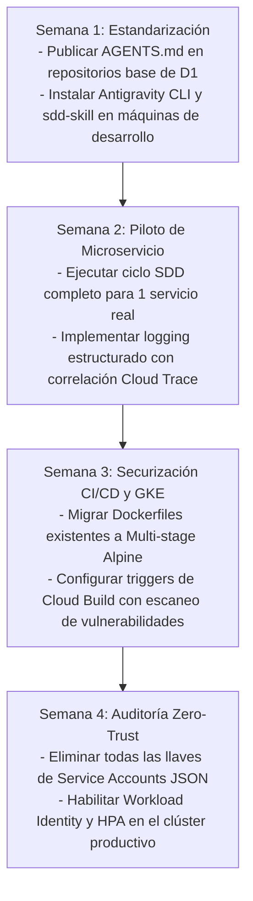

# Encuesta de Adopción, Madurez y Evaluación del Workshop

**Evento:** Workshop Técnico: De la Especificación a Producción en GCP  
**Cliente:** Tiendas D1  
**Lugar:** Google Cloud Bogotá  
**Instructor:** Felipe Andrés Velásquez Castro (AI Architecture Lead, Axmos)  

---

## 1. Evaluación de Madurez Pre-Workshop vs. Post-Workshop

Esta matriz permite al liderazgo técnico de Tiendas D1 medir el salto cualitativo del equipo antes y después de la capacitación de 4 horas:

| Dominio Técnico | Nivel Inicial (Típico) | Nivel Objetivo Post-Workshop | Métrica de Éxito |
| :--- | :--- | :--- | :--- |
| **Ingeniería con IA (SDD)** | Uso reactivo de ChatGPT/Copilot como autocompletador ("vibe coding") | Uso formal de Google Antigravity con ciclo SDD (`spec.md` $\to$ `plan.md` $\to$ tests) | 100% de los nuevos microservicios inician con spec formal |
| **Seguridad de APIs** | APIs con auth básica o validación ad-hoc en controladores | Zero-Trust con Google Identity Platform, OpenAPI 3.0 vivo y Rate Limiting | 0 endpoints productivos sin documentación OpenAPI |
| **Observabilidad** | `console.log()` en texto plano y búsquedas manuales | Logs JSON estructurados con severidad GCP y Cloud Trace correlation | Reducción del MTTR (tiempo medio de resolución) en 60% |
| **Contenerización & CI/CD** | Builds manuales o imágenes monolíticas pesadas (>1 GB) | Dockerfiles Multi-stage ultraligeros (<100 MB), Cloud Build y Artifact Registry inmutable | Tiempos de despliegue < 3 minutos por commit |
| **Kubernetes en GKE** | Llaves JSON montadas en secretos y escalado manual de réplicas | Workload Identity (KSA $\to$ GSA), Ingress con certificados Google y HPA automático | Cero llaves de servicio JSON en clústeres de GKE |

---

## 2. Formulario de Evaluación para Participantes (Google Forms / Tipo Likert)

### Sección 1: Perfil del Asistente
- **Rol en Tiendas D1:**
  - [ ] Tech Lead / Arquitecto de Software
  - [ ] Desarrollador Backend
  - [ ] Desarrollador Frontend
  - [ ] Ingeniero DevOps / SRE / Cloud
  - [ ] QA / Automatizador de Pruebas
- **Años de experiencia trabajando con Google Cloud:**
  - [ ] Menos de 1 año
  - [ ] 1 a 3 años
  - [ ] Más de 3 años

---

### Sección 2: Calidad Técnica del Contenido (Escala 1 a 5)
*(1: Totalmente en desacuerdo | 5: Totalmente de acuerdo)*

1. **Relevancia para los desafíos reales de Tiendas D1:**
   - *¿El caso práctico del microservicio de inventario y catálogo reflejó la complejidad que enfrentamos en tiendas físicas y comercio digital?*  
   `[ 1 ] [ 2 ] [ 3 ] [ 4 ] [ 5 ]`

2. **Metodología SDD (Specification-Driven Development):**
   - *¿Consideras que especificar formalmente con Antigravity antes de codificar reduce el retrabajo y las alucinaciones de la IA?*  
   `[ 1 ] [ 2 ] [ 3 ] [ 4 ] [ 5 ]`

3. **Arquitectura y Seguridad en GCP:**
   - *¿La implementación de Workload Identity y Secret Manager te brinda herramientas concretas para eliminar llaves inseguras en tus proyectos?*  
   `[ 1 ] [ 2 ] [ 3 ] [ 4 ] [ 5 ]`

4. **DevOps y Automatización:**
   - *¿El pipeline de Cloud Build y la optimización de imágenes Multi-Stage son aplicables de forma inmediata en tu sprint actual?*  
   `[ 1 ] [ 2 ] [ 3 ] [ 4 ] [ 5 ]`

5. **Claridad y Dominio del Instructor:**
   - *¿El instructor demostró dominio técnico profundo, rigor conceptual y resolvió eficazmente las dudas del equipo?*  
   `[ 1 ] [ 2 ] [ 3 ] [ 4 ] [ 5 ]`

---

### Sección 3: Preguntas Cualitativas y Próximos Pasos

1. **¿Cuál fue el concepto o herramienta más valiosa que aprendiste hoy y que implementarás primero?**  
   *(Espacio libre para respuesta abierta)*

2. **¿Qué iniciativa o microservicio de Tiendas D1 consideras el candidato ideal para un piloto de desarrollo con Antigravity y SDD durante las próximas 2 semanas?**  
   *(Espacio libre para respuesta abierta)*

3. **Sugerencias de profundización para futuros workshops técnicos de Axmos & Google Cloud:**  
   - [ ] Event-Driven Architecture con Cloud Run, Eventarc y Pub/Sub
   - [ ] Bases de datos a escala global: Spanner vs. Cloud SQL High Availability
   - [ ] Anthos & Service Mesh (Istio) para tráfico Canary y mTLS avanzado
   - [ ] FinOps en GCP: Optimización agresiva de costos de cómputo y almacenamiento

---

## 3. Plan de Acción de Adopción a 30 Días (Post-Workshop)

