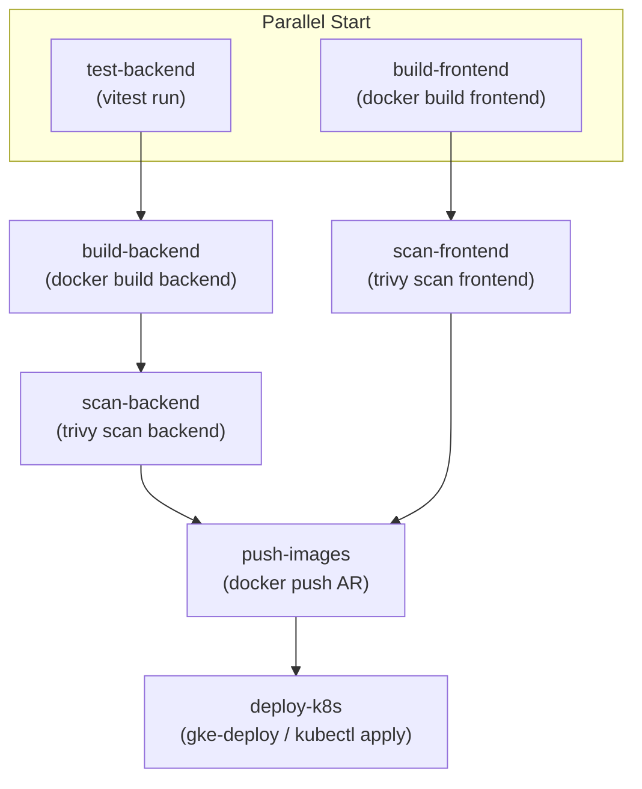

# Blueprint Arquitectónico: DevSecOps CI/CD & Manifiestos GKE

## 1. Estructura de Archivos
```text
k8s/
├── namespace.yaml
├── configmap.yaml
├── secret.yaml
├── backend-deployment.yaml
├── backend-service.yaml
├── frontend-deployment.yaml
├── frontend-service.yaml
├── ingress.yaml
└── hpa.yaml
cloudbuild.yaml
```

## 2. Definición del Pipeline Cloud Build (DAG)


## 3. Parámetros y Sustituciones Dinámicas
- `_CLUSTER_NAME`: `retail-private-cluster`
- `_CLUSTER_LOCATION`: `us-central1-a`
- `_REPO_NAME`: `retail-docker-repo`
- Inyección de imagen con `$SHORT_SHA`:
  - `us-central1-docker.pkg.dev/$PROJECT_ID/${_REPO_NAME}/retail-backend:${SHORT_SHA}`
  - `us-central1-docker.pkg.dev/$PROJECT_ID/${_REPO_NAME}/retail-frontend:${SHORT_SHA}`
