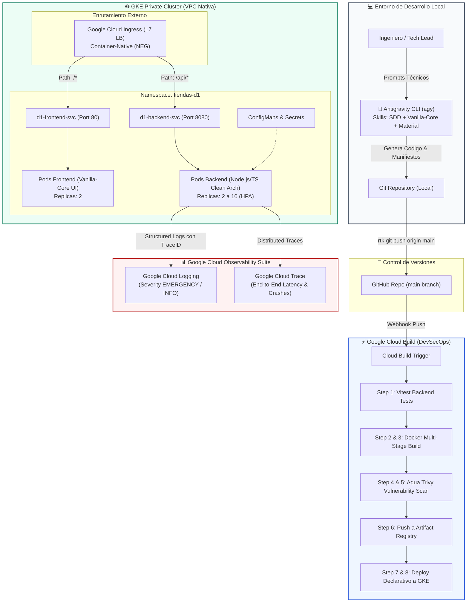

# 🚀 Workshop Hands-on: Modernización Cloud Native & AI-Assisted Engineering con GCP 2026
## Formato Cloud Skills Boost / Qwiklabs — Tiendas D1 Bogotá

> **Duración estimada:** 4 Horas  
> **Nivel:** Intermedio - Avanzado  
> **Audiencia:** Desarrolladores Full-Stack, Arquitectos Cloud, Tech Leads, DevOps/SRE  
> **Filosofía de Despliegue:** **GitOps Puro**. Queda prohibido el despliegue manual mediante Cloud SDK local (`gcloud run deploy` / `gcloud compute`). Todo cambio de código o infraestructura se define declarativamente y se despliega automáticamente mediante **Git -> Google Cloud Build -> GKE**.

---

## 🧭 Diagrama de Arquitectura del Workshop



---

## 📑 Agenda del Workshop (4 Horas)

| Módulo | Tema Clave | Duración |
| :--- | :--- | :--- |
| **Lab 01** | Instalación de Antigravity CLI y Ecosistema de Skills 2026 | 20 min |
| **Lab 02** | Creación de Microservicios Desacoplados (Backend TS & Frontend Vanilla-Core) | 30 min |
| **Lab 03** | Pruebas Unitarias de Backend & Validación de Calidad de Código | 20 min |
| **Lab 04** | Contenerización Multi-Stage Segura (Dockerfiles Non-Root) | 20 min |
| **Lab 05** | Pipeline Declarativo en Cloud Build con DAG Order (`waitFor`) y Trivy Scan | 30 min |
| **Lab 06** | Manifiestos Declarativos para GKE Private Cluster | 20 min |
| **Lab 07** | Configuración de Trigger GitOps (GitHub -> Cloud Build) | 20 min |
| **Lab 08** | Enrutamiento Externo con GKE Ingress & Container-Native Load Balancing (NEG) | 20 min |
| **Lab 09** | Gestión de Configuración y Secretos (ConfigMaps & Secrets) | 15 min |
| **Lab 10** | Escalabilidad Horizontal de Pods (HPA basado en CPU) | 15 min |
| **Lab 11** | Inyección de Caos (Chaos Testing), Auto-Sanación de GKE & Troubleshooting con Cloud Trace y Cloud Logging | 30 min |

---

## 🛠️ Lab 01: Setup del Asistente Autónomo (Antigravity CLI, RTK & Skills 2026)

### 🎯 Objetivo
Configurar el entorno de desarrollo con la herramienta oficial de pair programming asistido por IA de Google: **Antigravity CLI (`agy`)**, el optimizador de tokens **RTK (Rust Token Killer)**, e instalar las habilidades especializadas de desarrollo guiado por especificaciones (**SDD**) y frontend ultra ligero (**Vanilla-Core UI & Material Design 3**).

### ⚡ RTK (Rust Token Killer): Optimización Obligatoria de Terminal
Para garantizar que los comandos con prefijo `rtk` funcionen inmediatamente en cualquier máquina que clone este repositorio sin arrojar `command not found`, el repositorio incluye:
1. **Reglas de Agente:** [`.agents/rules/antigravity-rtk-rules.md`](file:///Users/felipe/Desarrollo/full-stack-engineer/.agents/rules/antigravity-rtk-rules.md)
2. **Skill de Proyecto:** [`.agents/skills/rtk/SKILL.md`](file:///Users/felipe/Desarrollo/full-stack-engineer/.agents/skills/rtk/SKILL.md)
3. **Shim Transparente de Fallback:** [`bin/rtk`](file:///Users/felipe/Desarrollo/full-stack-engineer/bin/rtk) (si `rtk` no está instalado en el sistema operativo, ejecuta el comando nativo de forma transparente sin fallar).

#### Instalación del Binario Oficial RTK (60-90% de Ahorro de Tokens):
```bash
# Opción 1: macOS con Homebrew (Recomendada)
brew install rtk

# Opción 2: Linux / macOS con script oficial
curl -fsSL https://www.rtk-ai.app/install.sh | sh

# Opción 3: Fallback sin instalación (usar el shim local del repositorio o alias)
export PATH="./bin:$PATH"
# O bien: alias rtk=''
```

### 📦 Paquetes y Skills Oficiales a Instalar
1. **Google Antigravity CLI:** Orquestador de agentes y pair-programming de Google.
2. **SDD Skill (Spec-Driven Development):** [`github.com/develasquez/sdd-skill`](https://github.com/develasquez/sdd-skill)
3. **Vanilla-Core UI:** [`vanilla-core-ui`](https://www.npmjs.com/package/vanilla-core-ui)
4. **Material Design 3:** [`@develasquez/material-design`](https://www.npmjs.com/package/@develasquez/material-design)

### 💻 Comandos en Terminal
```bash
# 1. Instalar Antigravity CLI globalmente
rtk npm install -g @google/antigravity-cli

# 2. Verificar versión instalada y estado de RTK
rtk agy --version
rtk gain

# 3. Instalar los skills especializados en tu entorno
rtk agy skill install https://github.com/develasquez/sdd-skill.git
rtk npm install vanilla-core-ui @develasquez/material-design
```

### 🤖 Prompt para Antigravity
> *"Actúa como Tech Lead en Tiendas D1. Valida que el entorno de desarrollo tenga activos los skills de Spec-Driven Development (SDD), RTK para optimización de tokens en CLI, y Vanilla-Core UI con Material Design 3. Configura el workspace para trabajar con arquitectura desacoplada frontend/backend sin dependencias innecesarias."*

---

## 🧩 Lab 02: Creación Full-Stack con SDD (Specification-Driven Development)

### 🎯 Objetivo
En el 2026 superamos la etapa del *"vibe coding"* reactivo. En Tiendas D1 el desarrollo es **determinista y guiado por especificaciones formales (SDD)**:
1. Se define la especificación contractual y los criterios de aceptación en un documento formal (`specs/d1-retail-platform.spec.md`).
2. Antigravity genera la arquitectura, las interfaces y los tests automáticamente a partir de dicha especificación.

### 🤖 Prompt Simple y Claro para SDD (`/sdd-specify`)
Copia y pega este único prompt en Antigravity CLI para generar el sistema completo con todas sus capacidades:

```text
/sdd-specify Diseña la plataforma de inventario para Tiendas D1 en dos proyectos desacoplados (backend/ y frontend/) con las siguientes capacidades:

1. backend/: Microservicio Node.js 20 con TypeScript y Clean Architecture.
   - Entidad e inventario de productos (SKU, nombre, categoría, precio, stock).
   - Caso de uso ReserveStock que valide existencias y bloquee sobreventas con error 400.
   - Logger estructurado para Google Cloud Logging con severidades INFO, WARNING, EMERGENCY y traza en logging.googleapis.com/trace.
   - Endpoint de Caos POST /api/v1/chaos/crash que emita log EMERGENCY con stack trace y ejecute process.exit(1) para probar la auto-recuperación del Pod en GKE.
   - Tests unitarios completos con Vitest.

2. frontend/: Single Page Application con Vanilla-Core UI y Material Design 3 (@develasquez/material-design).
   - Store central reactivo en store.js (SSoT + Pub/Sub) con renderizado quirúrgico anti-thrashing en ui/renderer.js.
   - Header con branding D1 y badge de tienda, tabla de inventario en vivo con botones de reserva, y panel interactivo para detonar el fallo fatal de Caos.
   - Servidor estático Express sobre el puerto 80 con health check en /health.
```

### 🔍 Resultado del Flujo SDD
Antigravity procesará la especificación y generará de forma determinista:
- La especificación formal en [`specs/d1-retail-platform.spec.md`](file:///Users/felipe/Desarrollo/full-stack-engineer/specs/d1-retail-platform.spec.md).
- El microservicio backend estructurado en [`backend/`](file:///Users/felipe/Desarrollo/full-stack-engineer/backend/).
- La aplicación web sin frameworks pesados en [`frontend/`](file:///Users/felipe/Desarrollo/full-stack-engineer/frontend/).

### 💻 Comandos en Terminal
```bash
# Inspeccionar la estructura creada
rtk ls -la backend
rtk ls -la frontend
rtk ls -la specs
```

---

## 🧪 Lab 03: Pruebas Unitarias de Backend & Calidad de Código

### 🎯 Objetivo
Asegurar que la lógica de negocio de reserva de inventario de Tiendas D1 esté protegida contra sobreventa y errores de concurrencia mediante pruebas unitarias ejecutadas con **Vitest**.

### 🤖 Prompt para Antigravity
> *"Escribe un conjunto de pruebas unitarias exhaustivas con Vitest en `backend/tests/reserve-stock.test.ts` para validar:
> 1. Reserva exitosa cuando hay inventario suficiente.
> 2. Rechazo con `InsufficientStockError` cuando se solicita más stock del disponible.
> 3. Lanzamiento de `ProductNotFoundError` cuando el SKU no existe en la tienda.
> Verifica que los logs estructurados emitan las severidades correctas."*

### 💻 Comandos en Terminal
```bash
# Ejecutar los tests unitarios
cd backend
rtk npm test
```

### 🔍 Salida Esperada
```text
✓ tests/reserve-stock.test.ts (3 tests)
✓ tests/chaos.test.ts (1 test)
Test Files  2 passed (2)
     Tests  4 passed (4)
```

---

## 🐳 Lab 04: Contenerización Multi-Stage Segura (Dockerfiles)

### 🎯 Objetivo
Construir imágenes de contenedor ultraligeras, seguras y libres de privilegios root para Backend y Frontend.

### 🛡️ Principios DevSecOps Aplicados
- **Compilación Multi-Stage:** Los artefactos de compilación y devDependencies (`typescript`, `vitest`) no pasan a la imagen de producción.
- **Usuario Non-Root:** El contenedor corre bajo el usuario `node` (UID 1000) para prevenir escalado de privilegios en el clúster GKE.
- **Base Alpine Linux:** Superficie de ataque reducida a menos de 50MB por imagen.

### 🤖 Prompt para Antigravity
> *"Diseña un `Dockerfile` multi-stage en `backend/` y otro en `frontend/`. Asegúrate de:
> 1. Usar imagen base `node:20-alpine`.
> 2. En la etapa de runtime, utilizar `USER node`.
> 3. Instalar solo dependencias de producción (`npm ci --omit=dev`).
> 4. Exponer el puerto correspondiente (8080 para backend, 80 para frontend).
> 5. Configurar archivos `.dockerignore` para omitir node_modules y logs."*

---

## ⚡ Lab 05: Pipeline Declarativo en Google Cloud Build (`cloudbuild.yaml`)

### 🎯 Objetivo
Configurar el pipeline de Integración Continua y Despliegue Continuo (CI/CD) usando las mejores prácticas de **Google Cloud Build**:
- **Concurrencia y orden de ejecución con `waitFor`**: Ejecución en paralelo de tareas independientes (test backend y build frontend) para minimizar tiempos de espera ([Cloud Build Step Order](https://docs.cloud.google.com/build/docs/configuring-builds/configure-build-step-order)).
- **Escaneo de vulnerabilidades con Aqua Trivy**: Detección temprana de CVEs en las imágenes generadas antes de enviarlas a producción ([Trivy Getting Started](https://trivy.dev/docs/latest/getting-started/)).

### 🤖 Prompt para Antigravity
> *"Genera el archivo `cloudbuild.yaml` en la raíz del proyecto para implementar un pipeline DevSecOps completo:
> 1. Paso 1 (`test-backend`): Corre `npm test` en backend. `waitFor: ['-']`.
> 2. Paso 2 (`build-backend`): Construye la imagen Docker del backend. `waitFor: ['test-backend']`.
> 3. Paso 3 (`build-frontend`): Construye la imagen Docker del frontend en paralelo. `waitFor: ['-']`.
> 4. Pasos 4 y 5: Escanea ambas imágenes usando `aquasec/trivy:latest` con severidad HIGH,CRITICAL.
> 5. Paso 6: Publica las imágenes en Google Artifact Registry (`d1-docker-repo`).
> 6. Paso 7: Reemplaza las variables del clúster y el SHA del commit en los manifiestos de `k8s/`.
> 7. Paso 8: Aplica los manifiestos en GKE de forma declarativa con `kubectl apply -f k8s/`."*

### 📄 Inspección del Pipeline Creado
Revisa el archivo [cloudbuild.yaml](file:///Users/felipe/Desarrollo/full-stack-engineer/cloudbuild.yaml) generado en la raíz.

---

## ☸️ Lab 06: Manifiestos Declarativos para GKE Private Cluster

### 🎯 Objetivo
Definir toda la infraestructura de la aplicación en archivos YAML dentro de la carpeta `k8s/`, respetando los lineamientos de seguridad para clústeres privados de GKE:
- Sin IPs públicas en los nodos trabajadores.
- Sondas de vida (`livenessProbe`) y de preparación (`readinessProbe`).
- Límites y solicitudes de CPU/Memoria (`requests` y `limits`).

### 🤖 Prompt para Antigravity
> *"Crea los manifiestos de Kubernetes en la carpeta `k8s/`:
> 1. `namespace.yaml`: Namespace `tiendas-d1`.
> 2. `backend-deployment.yaml`: Deployment con 2 réplicas, sondas `/health` y `/ready` en puerto 8080, recursos limitados (100m CPU / 128Mi RAM request).
> 3. `backend-service.yaml`: Service ClusterIP con anotación `cloud.google.com/neg: '{\"ingress\": true}'`.
> 4. `frontend-deployment.yaml` y `frontend-service.yaml`: Deployment y Service para el portal web.
> 5. `ingress.yaml`: Ingress GKE apuntando a ambos servicios."*

### 💻 Comandos en Terminal
```bash
# Validar los manifiestos generados
rtk ls -la k8s/
```

---

## 🐙 Lab 07: Conexión GitOps (Cloud Build Trigger con GitHub)

### 🎯 Objetivo
Implementar la filosofía **GitOps**: los desarrolladores no tocan el clúster ni usan comandos `gcloud` en su máquina local. Todo cambio de código viaja por Git y es aplicado por Cloud Build.

### 📋 Pasos de Configuración en la Consola de GCP
1. Ve a **Google Cloud Console** > **Cloud Build** > **Triggers (Activadores)**.
2. Haz clic en **Crear activador**.
3. Selecciona el repositorio de GitHub vinculado a Tiendas D1.
4. En **Evento**, selecciona **Enviar a una rama** (Push to a branch) sobre `^main$`.
5. En **Configuración**, selecciona **Archivo de configuración de Cloud Build (yaml o json)** y apunta a `/cloudbuild.yaml`.
6. En **Variables de sustitución**, verifica:
   - `_CLUSTER_NAME`: `d1-private-cluster`
   - `_CLUSTER_LOCATION`: `us-central1-a`
   - `_REPO_NAME`: `d1-docker-repo`
7. Haz clic en **Crear**.

### 💻 Disparo del Despliegue con Git
```bash
# Agregar cambios locales y enviarlos a GitHub
rtk git add .
rtk git commit -m "feat: pipeline Cloud Build con Trivy y despliegue GitOps en GKE"
rtk git push origin main
```
> 🔔 **Resultado:** Cloud Build detecta el commit, ejecuta los tests, analiza las imágenes con Trivy, sube las imágenes a Artifact Registry y actualiza automáticamente el clúster de GKE.

---

## 🌐 Lab 08: Enrutamiento Externo con GKE Ingress & Container-Native Load Balancing

### 🎯 Objetivo
Exponer la solución al tráfico de clientes mediante el controlador de Ingress oficial de Google Kubernetes Engine, aprovechando los **Network Endpoint Groups (NEG)**.

### 💡 ¿Por qué Container-Native Load Balancing (NEG)?
Tradicionalmente, un balanceador de carga L7 envía el tráfico a un nodo del clúster (NodePort), y `kube-proxy` realiza un salto adicional (SNAT) hasta el Pod.  
Con la anotación `cloud.google.com/neg: '{"ingress": true}'`, Google Cloud integra el Cloud HTTP(S) Load Balancer directamente con las IPs virtuales de los Pods:
- **Cero saltos intermedios:** Latencia reducida en un 30-40%.
- **Health Checks directos:** Google Cloud detecta el fallo del Pod directamente, no a nivel de máquina virtual.

### 📄 Inspección del Ingress
Revisa [k8s/ingress.yaml](file:///Users/felipe/Desarrollo/full-stack-engineer/k8s/ingress.yaml):
- Rutas:
  - `/api/*` ➡️ Enrutado al microservicio `d1-backend-svc:8080`.
  - `/*` ➡️ Enrutado a la Single Page Application `d1-frontend-svc:80`.

---

## 🔒 Lab 09: Gestión de Configuración y Secretos (ConfigMaps & Secrets)

### 🎯 Objetivo
Desacoplar la configuración sensible y no sensible del código fuente, inyectando variables de entorno en tiempo de ejecución.

### 🤖 Prompt para Antigravity
> *"Genera los manifiestos `k8s/configmap.yaml` y `k8s/secret.yaml` para Tiendas D1.
> El ConfigMap debe contener configuraciones de entorno (`NODE_ENV`, `PORT`, `DEFAULT_STORE_ID`, `LOG_LEVEL`).
> El Secret debe almacenar credenciales sensibles simuladas (`DB_PASSWORD`, `API_SIGNING_KEY`).
> Inyéctalos en el deployment del backend mediante `envFrom` y `secretKeyRef`."*

### 💻 Verificación en el Clúster
```bash
# Verificación de variables dentro del Pod (ejecutado por Cloud Build o en consola)
rtk kubectl get configmap tiendas-d1-config -n tiendas-d1 -o yaml
rtk kubectl get secret tiendas-d1-secrets -n tiendas-d1 -o yaml
```

---

## 📈 Lab 10: Resiliencia y Escalabilidad Horizontal de Pods (HPA)

### 🎯 Objetivo
Configurar el escalado elástico automático para soportar picos de transacciones en días de alta demanda (como promociones de fin de semana en Tiendas D1).

### 🤖 Prompt para Antigravity
> *"Crea un manifiesto `k8s/hpa.yaml` para el backend `d1-backend`.
> Configura un mínimo de 2 réplicas y un máximo de 10 réplicas, con un umbral de activación del 70% de utilización promedio de CPU. Asegúrate de que apunte a la API `autoscaling/v2`."*

### 💻 Monitoreo del Autoscaling
```bash
# Monitorear la utilización de CPU y réplicas en tiempo real
rtk kubectl get hpa d1-backend-hpa -n tiendas-d1 -w
```

---

## 💥 Lab 11: Inyección de Caos (Chaos Testing), Auto-Sanación de GKE & Troubleshooting con Cloud Trace y Cloud Logging

### 🎯 Objetivo
Comprobar en la práctica la resiliencia de la plataforma:
1. Provocar un fallo catastrófico intencional en el Pod de backend mediante un endpoint de Caos (`process.exit(1)`).
2. Observar en vivo cómo el Kubelet de GKE detecta la muerte del proceso, marca el Pod en estado de error y crea inmediatamente una réplica sustituta para mantener el SLA.
3. Realizar el análisis forense de causa raíz en **Google Cloud Logging** y **Google Cloud Trace**.

---

### 🔬 1. Código del Caso de Caos en Backend
Revisa [backend/src/domain/use-cases/chaos.use-case.ts](file:///Users/felipe/Desarrollo/full-stack-engineer/backend/src/domain/use-cases/chaos.use-case.ts):
```typescript
// Emisión de log estructurado con la severidad más crítica de GCP
StructuredLogger.emergency(`[CHAOS SIMULATION] Pod terminando de forma forzada: ${reason}`, {
  chaosDetails: { reason, nodeVersion: process.version, pid: process.pid },
  error: 'FATAL_POD_CRASH_SIMULATION',
  stack: new Error('FATAL_POD_CRASH_SIMULATION').stack,
  sourceLocation: { function: 'ChaosUseCase.triggerFatalCrash' }
});

// Provocar la muerte del contenedor
setTimeout(() => {
  process.exit(1);
}, 100);
```

---

### 🖱️ 2. Provocación del Crash desde el Frontend
1. Abre el portal web en tu navegador.
2. En la sección superior **"⚡ Inyección de Fallas & Auto-Recuperación GKE (Chaos Testing)"**, haz clic en el botón rojo:
   ```text
   💥 Provocar Fatal Crash en Backend
   ```
3. Alternativamente, puedes invocar el endpoint mediante `curl`:
   ```bash
   curl -X POST http://<IP_INGRESS_O_LOCALHOST>/api/v1/chaos/crash \
     -H "Content-Type: application/json" \
     -d '{"reason": "Prueba de resiliencia en vivo Workshop D1"}'
   ```

---

### 👁️ 3. Monitoreo en Tiempo Real de la Auto-Sanación en GKE
En tu terminal con conexión al clúster, ejecuta el comando de seguimiento continuo:
```bash
rtk kubectl get pods -n tiendas-d1 -w
```

#### 🔍 Qué observarás en la terminal:
```text
NAME                          READY   STATUS    RESTARTS   AGE
d1-backend-7bf69799fd-4x92m   1/1     Running   0          5m
d1-backend-7bf69799fd-k8s21   1/1     Running   0          5m

# Al hacer clic en el botón de Caos:
d1-backend-7bf69799fd-4x92m   0/1     Error     0          5m12s
d1-backend-7bf69799fd-4x92m   0/1     CrashLoopBackOff   1          5m14s
d1-backend-7bf69799fd-8wplq   0/1     Pending   0          1s
d1-backend-7bf69799fd-8wplq   0/1     ContainerCreating   0          2s
d1-backend-7bf69799fd-8wplq   1/1     Running   0          4s
```
> **Explicación para el equipo de D1:**  
> El **Kubelet** vigila el proceso raíz (PID 1) del contenedor. Al recibir el código de salida `1`, el proceso finaliza de inmediato. El controlador de réplicas de Kubernetes (`ReplicaSet`) detecta que el estado deseado es 2 réplicas y el estado actual es 1, por lo que programa inmediatamente un nuevo Pod (`8wplq`) en un nodo disponible. **El servicio de D1 nunca deja de responder a las tiendas.**

---

### 🔎 4. Análisis Forense en Google Cloud Logging
Abre **Google Cloud Console** > **Logging** > **Explorador de registros** (Logs Explorer) y pega la siguiente consulta optimizada:

```sql
resource.type="k8s_container"
resource.labels.namespace_name="tiendas-d1"
severity="EMERGENCY"
jsonPayload.sourceLocation.function="ChaosUseCase.triggerFatalCrash"
```

#### 📋 Lo que revela el log estructurado:
- **Timestamp milimétrico:** Momento exacto del fallo.
- **Función emisora:** `ChaosUseCase.triggerFatalCrash`.
- **StackTrace completo:** Pila de llamadas que provocó la detención del proceso.
- **Trace Context:** Vinculación directa con el identificador de traza distribuida `logging.googleapis.com/trace`.

---

### ⏱️ 5. Correlación de Latencias y Fallas en Google Cloud Trace
1. Ve a **Google Cloud Console** > **Trace** > **Lista de seguimiento** (Trace List).
2. Filtra por código de estado HTTP `500` o URI `/api/v1/chaos/crash`.
3. Haz clic en la traza correspondiente:
   - Podrás ver el recorrido completo de la solicitud: Ingress Load Balancer ➡️ Service ➡️ Pod Backend.
   - Observarás el momento en que el Pod cortó abruptamente la conexión TCP debido al `process.exit(1)`.
   - Podrás correlacionar el **Trace ID** con la entrada de registro en Cloud Logging con un solo clic.

---

## 🏆 Resumen de Capacidades Adquiridas

Al finalizar este workshop de 4 horas, el equipo de **Tiendas D1** ha experimentado y validado de primera mano:
1. **Asistencia de IA de Nueva Generación con Antigravity:** Generación guiada por prompts pequeños y directos para arquitectura limpia y frontend liviano.
2. **Frontend Eficiente con Vanilla-Core UI & Material Design 3:** Eliminación de sobreingeniería y frameworks pesados en portales de tienda.
3. **DevSecOps con Cloud Build y Trivy:** Puertas de calidad y escaneo de vulnerabilidades integradas en el pipeline sin ralentizar a los desarrolladores.
4. **GitOps Determinista:** Cero comandos manuales en clústeres productivos. Todo cambio es trazable en Git.
5. **Resiliencia & Observabilidad:** Auto-sanación instantánea en GKE y diagnóstico de fallas complejas en menos de 2 minutos utilizando Cloud Trace y Cloud Logging.

---
*Material preparado para el Workshop Técnico Tiendas D1 — Google Cloud Colombia 2026.*
