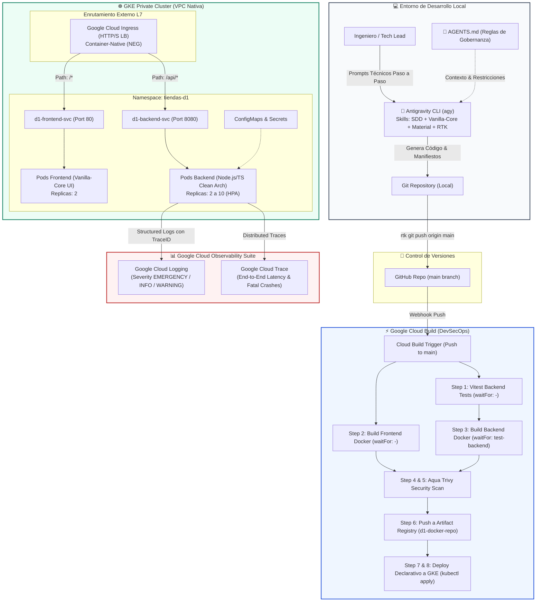

# 🚀 Workshop Hands-on: Modernización Cloud Native & AI-Assisted Engineering con GCP 2026
## Formato Cloud Skills Boost / Qwiklabs — Tiendas D1 Bogotá

> **Duración estimada:** 4 Horas  
> **Nivel:** Intermedio - Avanzado  
> **Audiencia:** Desarrolladores Full-Stack, Arquitectos Cloud, Tech Leads, DevOps/SRE  
> **Filosofía de Despliegue:** **GitOps Puro**. Queda prohibido el despliegue manual mediante Cloud SDK local (`gcloud run deploy` / `gcloud compute`). Todo cambio de código o infraestructura se define declarativamente y se despliega automáticamente mediante **Git -> Google Cloud Build -> GKE**.  
> **Contrato de Gobernanza:** Antes de comenzar, familiarízate con [`AGENTS.md`](file:///Users/felipe/Desarrollo/full-stack-engineer/AGENTS.md), el archivo maestro que define las reglas de arquitectura y previene alucinaciones en Antigravity.

---

## 🧭 Diagrama de Arquitectura del Workshop



---

## 📑 Agenda del Workshop (4 Horas)

| Módulo | Tema Clave | Entregable / Capacidad | Duración |
| :--- | :--- | :--- | :--- |
| **Lab 00** | Configuración de Antigravity CLI, Gobernanza con `AGENTS.md` & Token Killer RTK | Entorno listo con ahorro de tokens | 15 min |
| **Lab 01** | Instalación de Skills Especializados 2026 (`sdd-skill`, `vanilla-core-ui`, `material-design`) | Habilidades de IA cargadas | 15 min |
| **Lab 02** | Especificación Contractual con SDD (`/sdd-specify`) | `specs/d1-retail-platform.spec.md` | 25 min |
| **Lab 03** | Generación Asistida del Backend (Clean Architecture, Structured Logger & Chaos Endpoint) | `backend/src/` completo | 30 min |
| **Lab 04** | Pruebas Unitarias de Negocio y Caos con Vitest | `backend/tests/*.test.ts` pasando | 20 min |
| **Lab 05** | Generación Asistida del Frontend (Vanilla-Core UI + Material Design 3) | `frontend/` sin dependencias pesadas | 30 min |
| **Lab 06** | Contenerización Multi-Stage Segura (Dockerfiles Non-Root) | `Dockerfile` en backend y frontend | 20 min |
| **Lab 07** | Pipeline DevSecOps en Cloud Build (DAG `waitFor` & Escaneo Aqua Trivy) | `cloudbuild.yaml` con orden de ejecución | 25 min |
| **Lab 08** | Manifiestos Declarativos para GKE Private Cluster (NEG, Ingress, Probes, ConfigMap, Secret) | `k8s/*.yaml` listos | 25 min |
| **Lab 09** | Escalabilidad Elástica con Horizontal Pod Autoscaler (HPA v2) | `k8s/hpa.yaml` con auto-tuning | 15 min |
| **Lab 10** | Activación del Flujo GitOps (Push a GitHub -> Cloud Build -> GKE) | Despliegue automático sin Cloud SDK | 20 min |
| **Lab 11** | Inyección de Caos (Chaos Testing), Auto-Sanación de GKE & Troubleshooting en Cloud Trace y Logging | Resiliencia en vivo y análisis forense | 20 min |

---

## 🛠️ Lab 00: Configuración de Antigravity CLI, Gobernanza con `AGENTS.md` & Token Killer RTK

### 🎯 Objetivo
Configurar el entorno con la herramienta oficial de pair programming de Google: **Antigravity CLI (`agy`)**, activar el optimizador de tokens **RTK (Rust Token Killer)** para no agotar la ventana de contexto de los modelos, y revisar el contrato maestro de gobernanza [`AGENTS.md`](file:///Users/felipe/Desarrollo/full-stack-engineer/AGENTS.md).

### ⚡ RTK: Token Killer y Shim de Compatibilidad
Para que cualquier usuario que clone este repositorio pueda ejecutar comandos sin fallos de terminal:
- El repositorio incluye el shim transparente [`bin/rtk`](file:///Users/felipe/Desarrollo/full-stack-engineer/bin/rtk).
- Si `rtk` binario oficial no está en la máquina, el shim ejecuta el comando nativo de forma transparente.

```bash
# 1. Verificar o instalar Antigravity CLI
rtk npm install -g @google/antigravity-cli

# 2. Validar versión de Antigravity CLI
rtk agy --version

# 3. Opcional: Instalar el binario oficial de RTK (macOS/Linux)
# brew install rtk  (o curl -fsSL https://www.rtk-ai.app/install.sh | sh)
rtk gain
```

### 🤖 Prompt para Antigravity: Validación Inicial del Entorno
Copia y pega este prompt en la sesión interactiva de Antigravity:

```text
Lee el archivo AGENTS.md en la raíz de este repositorio. Confirma que entiendes todos los principios de gobernanza del proyecto:
1. Filosofía SDD para diseño de software antes de generar código.
2. Despliegue exclusivamente mediante GitOps (cero comandos de despliegue local con Cloud SDK).
3. Uso estricto del prefijo 'rtk' en comandos de terminal.
4. Clean Architecture para backend con Node.js 20/TypeScript y observabilidad estructurada de Google Cloud.
5. Vanilla-Core UI con Material Design 3 para frontend sin frameworks pesados.
Dame un resumen ejecutivo confirmando tu preparación para asistir al equipo de Tiendas D1.
```

---

## 📦 Lab 01: Instalación de Skills Especializados 2026

### 🎯 Objetivo
Cargar en Antigravity los skills necesarios para asistir al equipo de Tiendas D1 en desarrollo guiado por especificaciones (**SDD**) y diseño frontend ultraligero (**Vanilla-Core UI & Material Design 3**).

### 💻 Comandos en Terminal
```bash
# 1. Instalar el skill oficial de SDD
rtk agy skill install https://github.com/develasquez/sdd-skill.git

# 2. Instalar librerías de Vanilla-Core y Material Design 3
rtk npm install vanilla-core-ui @develasquez/material-design
```

### 🤖 Prompt para Antigravity: Activación de Skills
```text
Verifica la disponibilidad de los siguientes skills en el workspace:
- 'sdd-skill': Para gestionar comandos /sdd-specify, /sdd-clarify, /sdd-plan y /sdd-implement.
- 'vanilla-core-ui': Para generar componentes basados en Single Source of Truth (store.js) y renderizado quirúrgico.
- '@develasquez/material-design': Para aplicar tokens de diseño de Material Design 3 (M3).
- 'rtk': Para optimización de terminal.
Genera un checklist confirmando que los skills están listos para ser invocados en los siguientes laboratorios.
```

---

## 🧩 Lab 02: Especificación Contractual con SDD (`/sdd-specify`)

### 🎯 Objetivo
Superar el "vibe coding" caótico. En el 2026 en Tiendas D1 definimos primero la especificación formal del sistema en [`specs/d1-retail-platform.spec.md`](file:///Users/felipe/Desarrollo/full-stack-engineer/specs/d1-retail-platform.spec.md). Antigravity utiliza esta especificación como la verdad absoluta para construir la arquitectura sin supuestos inventados.

### 🤖 Prompt para Antigravity: Generación de la Especificación Formal
Copia y pega este comando/prompt en Antigravity:

```text
/sdd-specify Genera la especificación formal contractual en specs/d1-retail-platform.spec.md para la plataforma de inventario de Tiendas D1 Bogotá con dos proyectos desacoplados (backend/ y frontend/):

Requerimientos Funcionales y No Funcionales:
1. Backend (Microservicio Node.js 20 + TypeScript + Clean Architecture):
   - Modelo de dominio 'Product' con SKU, nombre, categoría, precio, stock disponible y tienda ID.
   - Caso de uso 'ReserveStockUseCase': decrementa el stock atómicamente si hay existencias; lanza 'InsufficientStockError' (HTTP 400) si el pedido supera el stock; lanza 'ProductNotFoundError' (HTTP 404) si el SKU no existe.
   - Endpoint de Caos 'ChaosUseCase' en POST /api/v1/chaos/crash: emite un log estructurado con severidad EMERGENCY y stack trace en formato Google Cloud Logging, y ejecuta process.exit(1) para forzar la muerte del Pod y evaluar la auto-recuperación de GKE.
   - Logger estructurado 'StructuredLogger' que exporte métodos info(), warn(), error() y emergency() inyectando el campo 'logging.googleapis.com/trace'.
   - Suite de pruebas unitarias con Vitest.

2. Frontend (Single Page Application Vanilla-Core UI + Material Design 3):
   - Almacén reactivo store.js (SSoT) con patrón Pub/Sub.
   - Mapeo de selectores en dom-elements.js y renderizado quirúrgico anti-thrashing en ui/renderer.js.
   - Componentes: Header con badge de tienda D1, Catálogo con botones reactivos de reserva de stock, y Panel de Caos para detonar la falla fatal con feedback visual.
   - Servidor estático Express en puerto 80 con endpoint /health.

3. Restricciones de Despliegue:
   - Todo desplegable debe correr en GKE Private Cluster con Container-Native Load Balancing (NEG).
   - El pipeline CI/CD en Cloud Build debe validar tests, compilar imágenes multi-stage y escanear con Aqua Trivy antes de aplicar manifiestos.
```

### 🔍 Verificación
Inspecciona el archivo formal generado en [`specs/d1-retail-platform.spec.md`](file:///Users/felipe/Desarrollo/full-stack-engineer/specs/d1-retail-platform.spec.md).

---

## ☕ Lab 03: Generación Asistida del Backend (Clean Architecture, Structured Logger & Chaos Endpoint)

### 🎯 Objetivo
Construir el microservicio de backend aplicando los principios de Clean Architecture y la integración nativa con Google Cloud Logging.

### 🤖 Prompt para Antigravity: Implementación del Backend
```text
Basándote estrictamente en specs/d1-retail-platform.spec.md y las directivas de AGENTS.md, genera el código del microservicio en backend/:

1. src/domain/entities/product.entity.ts:
   - Interface Product y tipo Category.
2. src/domain/errors/inventory.errors.ts:
   - Clases InsufficientStockError y ProductNotFoundError heredando de Error.
3. src/domain/use-cases/reserve-stock.use-case.ts:
   - Implementa ReserveStockUseCase validando stock, descontando la cantidad solicitada y emitiendo logs INFO o WARNING.
4. src/domain/use-cases/chaos.use-case.ts:
   - Implementa ChaosUseCase con método triggerFatalCrash(reason: string) que registre un log EMERGENCY con stack trace forense y llame a process.exit(1) tras 100ms.
5. src/infrastructure/logger/structured-logger.ts:
   - Clase StructuredLogger que formatee cada log en JSON con los campos estándar de Google Cloud: 'severity', 'message', 'timestamp', 'logging.googleapis.com/trace', 'serviceContext' y 'sourceLocation'.
6. src/infrastructure/http/server.ts y src/index.ts:
   - Servidor Express en puerto 8080 con endpoints GET /health, GET /ready, GET /api/v1/inventory, POST /api/v1/inventory/reserve y POST /api/v1/chaos/crash.
   - Manejador global de excepciones que traduzca InsufficientStockError a 400 y ProductNotFoundError a 404.
7. package.json y tsconfig.json con TypeScript 5.x, Express 4.x y Vitest.
```

### 💻 Comandos en Terminal
```bash
# Validar estructura y dependencias de backend
cd backend
rtk npm install
rtk npm run build
```

---

## 🧪 Lab 04: Pruebas Unitarias de Negocio y Caos con Vitest

### 🎯 Objetivo
Garantizar la estabilidad y calidad de código del backend antes de cualquier compilación de contenedor, validando tanto los casos de éxito y fallo en reservas como el comportamiento del endpoint de caos.

### 🤖 Prompt para Antigravity: Generación de Pruebas Unitarias
```text
Genera la suite de pruebas unitarias exhaustiva para el backend en backend/tests/:

1. backend/tests/reserve-stock.test.ts:
   - Test 1: Debe reservar stock exitosamente cuando hay suficiente inventario disponible.
   - Test 2: Debe lanzar InsufficientStockError cuando la cantidad solicitada supera el stock.
   - Test 3: Debe lanzar ProductNotFoundError cuando el SKU solicitado no existe.

2. backend/tests/chaos.test.ts:
   - Test 1: Debe emitir un log estructurado EMERGENCY y programar el apagado del proceso cuando se invoca triggerFatalCrash(). Mockea process.exit para que no mate la suite de tests.

Asegúrate de que los tests corran con Vitest y no tengan advertencias de tipos en TypeScript.
```

### 💻 Comandos en Terminal
```bash
# Ejecutar los tests con el proxy RTK
rtk npm test
```

### 🔍 Salida Esperada
```text
✓ tests/reserve-stock.test.ts (3 tests)
✓ tests/chaos.test.ts (1 test)
Test Files  2 passed (2)
     Tests  4 passed (4)
```

---

## 🎨 Lab 05: Generación Asistida del Frontend (Vanilla-Core UI + Material Design 3)

### 🎯 Objetivo
Construir una aplicación web moderna, accesible y ultrarrápida para los colaboradores de Tiendas D1, sin la sobrecarga ni vulnerabilidades de frameworks gigantes (cero dependencias de React, Angular o Vue).

### 🤖 Prompt para Antigravity: Implementación del Frontend
```text
Siguiendo las especificaciones de AGENTS.md y usando el skill 'vanilla-core-ui' con '@develasquez/material-design', genera la Single Page Application en frontend/:

1. frontend/store.js:
   - Almacén central (SSoT) con estado: { products, storeId: 'D1-BOG-001', storeName: 'Tienda D1 Calle 72 Bogotá', lastAction, chaosTriggered }.
   - Funciones exportadas: subscribe(callback) y setState(delta).
2. frontend/dom-elements.js:
   - Mapeo de elementos clave del DOM para evitar layout thrashing.
3. frontend/components/header/ (header.html, header.js):
   - Encabezado con branding Tiendas D1, badge de la tienda y estado de conexión.
4. frontend/components/catalog/ (catalog.html, catalog.js):
   - Listado en vivo de productos con botones para simular compras y reservas de inventario.
5. frontend/components/chaos-panel/ (chaos-panel.html, chaos-panel.js):
   - Panel de control de resiliencia con botón rojo '💥 Provocar Fatal Crash en Backend'. Al presionarlo, hace POST a /api/v1/chaos/crash y muestra alerta visual de desconexión.
6. frontend/ui/renderer.js:
   - Renderizador quirúrgico que actualice exclusivamente los valores numéricos y badges sin repintar el DOM activo.
7. frontend/server.js:
   - Servidor estático Express en puerto 80 con health check en GET /health.
8. frontend/index.html y frontend/style.css:
   - App Shell estilizado con Tailwind CSS y paleta de colores Material Design 3.
```

### 💻 Comandos en Terminal
```bash
# Probar el frontend localmente
cd ../frontend
rtk npm install
# Para previsualizar: node server.js (puerto 80 o puerto de desarrollo)
```

---

## 🐳 Lab 06: Contenerización Multi-Stage Segura (Dockerfiles Non-Root)

### 🎯 Objetivo
Empaquetar ambas aplicaciones en imágenes Docker ultraligeras y blindadas contra escalamiento de privilegios en Kubernetes.

### 🤖 Prompt para Antigravity: Generación de Dockerfiles
```text
Genera los archivos de contenerización multi-stage seguros para backend/ y frontend/:

1. backend/Dockerfile:
   - Stage 1 ('builder'): Imagen node:20-alpine, instala dependencias completas, compila TypeScript con 'npm run build'.
   - Stage 2 ('runner'): Imagen node:20-alpine, instala solo dependencias de producción ('npm ci --omit=dev'), copia el compilado dist/, expone puerto 8080.
   - Seguridad: Usa 'USER node' (UID 1000). Jamás correr como root.
2. frontend/Dockerfile:
   - Imagen node:20-alpine, instala dependencias de producción, corre server.js como 'USER node' en puerto 80.
3. backend/.dockerignore y frontend/.dockerignore:
   - Excluir node_modules, .git, dist, logs, archivos temporales.
```

---

## ⚡ Lab 07: Pipeline DevSecOps en Cloud Build (DAG `waitFor` & Aqua Trivy Scan)

### 🎯 Objetivo
Configurar el pipeline automatizado de integración y despliegue continuo en `cloudbuild.yaml` siguiendo la documentación oficial de Google Cloud Build sobre el orden de ejecución con `waitFor` y escaneo de CVEs con Aqua Trivy.

### 💡 Arquitectura del DAG en Cloud Build
```text
Paso 1: test-backend  (waitFor: ['-'])  ───┐
                                          ├──> Paso 3: build-backend (waitFor: ['test-backend']) ──> Paso 4: scan-backend (Trivy) ──┐
Paso 2: build-frontend (waitFor: ['-']) ───────────────────────────────────────────────────────────> Paso 5: scan-frontend (Trivy) ─┼──> Paso 6: Push a Artifact Registry ──> Paso 7 & 8: Deploy Declarativo a GKE
```

### 🤖 Prompt para Antigravity: Generación de `cloudbuild.yaml`
```text
Genera el archivo cloudbuild.yaml en la raíz del proyecto para orquestar el flujo DevSecOps completo en Google Cloud:

1. Paso 'test-backend':
   - Ejecuta 'npm test' en la carpeta backend/. Configura waitFor: ['-'].
2. Paso 'build-frontend':
   - Ejecuta 'docker build' para frontend. Configura waitFor: ['-'].
3. Paso 'build-backend':
   - Ejecuta 'docker build' para backend. Configura waitFor: ['test-backend'] (bloquea el build si los tests fallan).
4. Pasos 'scan-backend' y 'scan-frontend':
   - Usa la imagen oficial 'aquasec/trivy:latest'.
   - Escanea con: image --no-progress --severity HIGH,CRITICAL --exit-code 0 <IMAGEN>.
   - Configura waitFor correspondientes a sus respectivos builds.
5. Paso 'push-images':
   - Sube ambas imágenes a Google Artifact Registry ('d1-docker-repo').
6. Paso 'prepare-k8s':
   - Usa sed para reemplazar ${PROJECT_ID}, ${_REPO_NAME} y ${SHORT_SHA} en los archivos de k8s/.
7. Paso 'deploy-gke':
   - Obtiene credenciales del clúster con 'gcloud container clusters get-credentials ${_CLUSTER_NAME} --zone ${_CLUSTER_LOCATION}'.
   - Aplica los manifiestos con 'kubectl apply -f k8s/'.
8. Sustituciones por defecto:
   - _CLUSTER_NAME: 'd1-private-cluster'
   - _CLUSTER_LOCATION: 'us-central1-a'
   - _REPO_NAME: 'd1-docker-repo'
```

### 🔍 Verificación
Examina el archivo [cloudbuild.yaml](file:///Users/felipe/Desarrollo/full-stack-engineer/cloudbuild.yaml) resultante.

---

## ☸️ Lab 08: Manifiestos Declarativos para GKE Private Cluster

### 🎯 Objetivo
Definir toda la infraestructura de la aplicación en manifiestos YAML en `k8s/`, habilitando Container-Native Load Balancing con Network Endpoint Groups (NEG) y desacoplando secretos y configuración.

### 🤖 Prompt para Antigravity: Generación de Manifiestos de Kubernetes
```text
Genera los manifiestos declarativos de Kubernetes en la carpeta k8s/ bajo el namespace 'tiendas-d1':

1. k8s/namespace.yaml:
   - Namespace 'tiendas-d1'.
2. k8s/configmap.yaml:
   - ConfigMap 'tiendas-d1-config' con NODE_ENV, PORT, DEFAULT_STORE_ID, LOG_LEVEL.
3. k8s/secret.yaml:
   - Secret 'tiendas-d1-secrets' con DB_PASSWORD y API_SIGNING_KEY codificados en base64.
4. k8s/backend-deployment.yaml:
   - Deployment 'd1-backend' con 2 réplicas.
   - Sondas livenessProbe en /health y readinessProbe en /ready.
   - Recursos: requests (100m CPU, 128Mi RAM), limits (300m CPU, 256Mi RAM).
   - Inyección de variables desde el ConfigMap y Secret.
5. k8s/backend-service.yaml:
   - Service ClusterIP en puerto 8080 con anotación obligatoria:
     cloud.google.com/neg: '{"ingress": true}'
6. k8s/frontend-deployment.yaml y k8s/frontend-service.yaml:
   - Deployment 'd1-frontend' con 2 réplicas y Service ClusterIP con anotación NEG en puerto 80.
7. k8s/ingress.yaml:
   - Ingress GKE enrutando:
     - Path '/api/*' hacia d1-backend-svc:8080.
     - Path '/*' hacia d1-frontend-svc:80.
```

### 💻 Comandos en Terminal
```bash
# Validar la sintaxis de todos los manifiestos
rtk ls -la k8s/
```

---

## 📈 Lab 09: Escalabilidad Elástica con Horizontal Pod Autoscaler (HPA v2)

### 🎯 Objetivo
Configurar el auto-escalado horizontal de Pods para soportar variaciones súbitas de tráfico en Tiendas D1 durante jornadas de promociones especiales.

### 🤖 Prompt para Antigravity: Generación de HPA
```text
Crea el manifiesto k8s/hpa.yaml para autoescalar el microservicio d1-backend:
- API: autoscaling/v2.
- Target: Deployment d1-backend en el namespace tiendas-d1.
- Mínimo de réplicas: 2.
- Máximo de réplicas: 10.
- Métrica: Utilización promedio de CPU al 70%.
Explica cómo el Horizontal Pod Autoscaler interactúa con los 'requests' definidos en el deployment.
```

---

## 🐙 Lab 10: Activación del Flujo GitOps (Push a GitHub -> Cloud Build -> GKE)

### 🎯 Objetivo
Verificar la filosofía GitOps en la práctica: **los desarrolladores nunca ejecutan `gcloud deploy` localmente**. Todo cambio confirmado en Git dispara el pipeline automatizado.

### 📋 Pasos de Configuración en Google Cloud Console
1. Accede a **Google Cloud Console** > **Cloud Build** > **Activadores (Triggers)**.
2. Selecciona **Crear activador**.
3. Conecta el repositorio de GitHub de Tiendas D1.
4. En **Evento**, elige **Enviar a una rama** (Push to a branch) sobre `^main$`.
5. En **Configuración**, selecciona **Archivo de configuración de Cloud Build** y apunta a `/cloudbuild.yaml`.
6. Guarda el activador.

### 💻 Disparo del Despliegue con Git y RTK
```bash
# 1. Comprobar estado del repositorio local con RTK
rtk git status

# 2. Agregar cambios y realizar commit
rtk git add .
rtk git commit -m "feat: plataforma completa de inventario D1 con SDD, Trivy y GKE GitOps"

# 3. Empujar cambios a GitHub para iniciar el build automático
rtk git push origin main
```

### 🔍 Qué sucede en Google Cloud:
1. Cloud Build detecta el webhook de GitHub.
2. Corre la suite de tests unitarios de Vitest.
3. Compila las imágenes Docker multi-stage.
4. Aqua Trivy inspecciona las imágenes buscando vulnerabilidades `HIGH` o `CRITICAL`.
5. Se publican las imágenes en Google Artifact Registry.
6. Se aplican los manifiestos en GKE actualizando los Pods con Zero-Downtime Rolling Updates.

---

## 💥 Lab 11: Inyección de Caos (Chaos Testing), Auto-Sanación de GKE & Troubleshooting con Cloud Trace y Cloud Logging

### 🎯 Objetivo
Comprobar en vivo la alta disponibilidad y resiliencia de la plataforma:
1. Provocar un fallo catastrófico en un Pod de backend invocando el endpoint de caos (`process.exit(1)`).
2. Observar cómo el controlador de GKE detecta la muerte del proceso y crea inmediatamente un Pod de reemplazo sin interrumpir el servicio.
3. Realizar el diagnóstico forense en **Google Cloud Logging** y **Google Cloud Trace**.

---

### 🖱️ 1. Detonación del Fallo Catastrófico
Tienes dos alternativas para provocar la caída:
- **Desde la UI:** Abre el portal web en tu navegador y haz clic en el botón rojo:
  ```text
  💥 Provocar Fatal Crash en Backend
  ```
- **Desde la consola (Curl):**
  ```bash
  curl -X POST http://<INGRESS_IP_O_LOCALHOST:8080>/api/v1/chaos/crash \
    -H "Content-Type: application/json" \
    -d '{"reason": "Simulación de falla fatal en vivo Workshop Tiendas D1"}'
  ```

---

### 👁️ 2. Monitoreo en Vivo de la Auto-Sanación en GKE
En una ventana de terminal con acceso a `kubectl`, ejecuta la observación continua:
```bash
rtk kubectl get pods -n tiendas-d1 -w
```

#### 🔍 Secuencia de Eventos Observada en Consola:
```text
NAME                          READY   STATUS    RESTARTS   AGE
d1-backend-7bf69799fd-4x92m   1/1     Running   0          5m
d1-backend-7bf69799fd-k8s21   1/1     Running   0          5m

# Al detonar el caos:
d1-backend-7bf69799fd-4x92m   0/1     Error     0          5m12s
d1-backend-7bf69799fd-4x92m   0/1     CrashLoopBackOff   1          5m14s
d1-backend-7bf69799fd-8wplq   0/1     Pending   0          1s
d1-backend-7bf69799fd-8wplq   0/1     ContainerCreating   0          2s
d1-backend-7bf69799fd-8wplq   1/1     Running   0          4s
```
> **Lección de Arquitectura para el equipo D1:**  
> Gracias a los **Health Checks directos por NEG** y el controlador de **ReplicaSet de Kubernetes**, la caída de un Pod no genera caída del servicio para los usuarios de la tienda; el balanceador de carga redirige el tráfico a la réplica sana en milisegundos mientras el nuevo Pod completa su ciclo de inicialización.

---

### 🔎 3. Diagnóstico Forense en Google Cloud Logging
Abre **Google Cloud Console** > **Logging** > **Explorador de registros** y ejecuta el siguiente filtro:

```sql
resource.type="k8s_container"
resource.labels.namespace_name="tiendas-d1"
severity="EMERGENCY"
jsonPayload.sourceLocation.function="ChaosUseCase.triggerFatalCrash"
```

#### 📋 Datos Clave que Provee el Log Estructurado:
- **Severidad:** `EMERGENCY` (alerta prioritaria para el equipo SRE).
- **Stack Trace Completo:** Muestra la línea exacta donde se ejecutó la orden de corte.
- **Trace ID:** Campo `logging.googleapis.com/trace` para correlacionar con Cloud Trace.

---

### ⏱️ 4. Correlación de Solicitudes y Latencia en Google Cloud Trace
1. Dirígete a **Google Cloud Console** > **Trace** > **Lista de seguimiento**.
2. Filtra por la URI `/api/v1/chaos/crash` o código HTTP `500`.
3. Haz clic sobre la traza del evento:
   - Visualiza el tiempo exacto que tardó la solicitud desde el balanceador L7 hasta el backend.
   - Observa la interrupción de la conexión socket provocada intencionalmente.
   - Da clic directo en el enlace a Cloud Logging para ver el log de emergencia asociado a esa traza específica sin buscar manualmente.

---

## 🏆 Resumen de Capacidades Adquiridas

Al completar este workshop, los ingenieros de **Tiendas D1** dominan:
1. **Asistencia con Antigravity & SDD:** Creación de especificaciones formales y código predecible y sin alucinaciones guiado por `AGENTS.md`.
2. **Eficiencia de Contexto:** Reducción de costos de tokens con RTK en flujos de terminal.
3. **Frontend Moderno y Ligero:** Aplicaciones reactivas de alto rendimiento con Vanilla-Core UI y Material Design 3 sin frameworks pesados.
4. **DevSecOps en GCP:** Automatización de tests con Vitest, construcción paralela con `waitFor` y escaneo con Aqua Trivy en Google Cloud Build.
5. **Infraestructura Cloud Native:** Despliegue GitOps en GKE Private Cluster con Container-Native Load Balancing (NEG) y autoscaling elástico con HPA.
6. **Resiliencia & Observabilidad:** Diagnóstico forense en menos de dos minutos con Google Cloud Logging y Google Cloud Trace ante fallos críticos de pods.

---
*Material preparado para el Workshop Técnico Tiendas D1 — Google Cloud Colombia 2026.*
