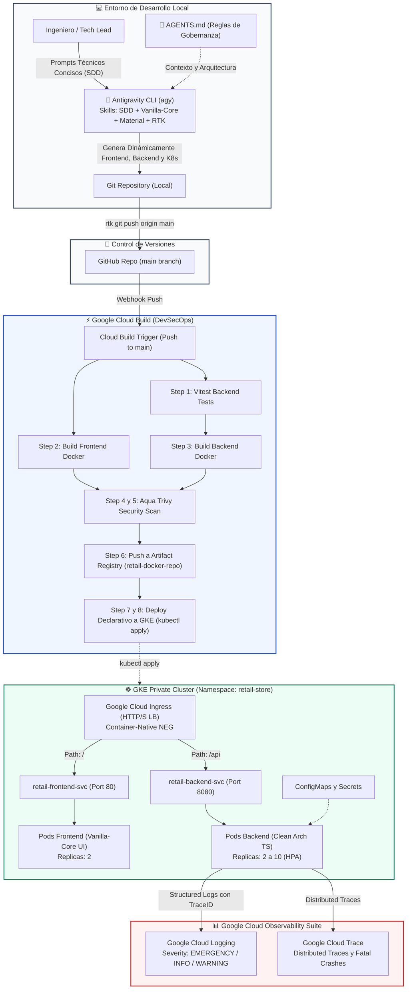

# 🚀 Workshop Hands-on: Modernización Cloud Native & AI-Assisted Engineering con GCP 2026
## Formato Cloud Skills Boost / Qwiklabs — Caso de Uso: Arquitectura Retail Enterprise

> **Duración estimada:** 4 Horas  
> **Nivel:** Intermedio - Avanzado  
> **Audiencia:** Desarrolladores Full-Stack, Arquitectos Cloud, Tech Leads, DevOps/SRE  
> **Filosofía de Despliegue:** **GitOps Puro**. Queda prohibido el despliegue manual mediante Cloud SDK local (`gcloud run deploy` / `gcloud compute`). Todo cambio de código o infraestructura se define declarativamente y se despliega automáticamente mediante **Git -> Google Cloud Build -> GKE**.  
> **Contrato de Gobernanza:** Antes de comenzar, revisa [`AGENTS.md`](file:///Users/felipe/Desarrollo/full-stack-engineer/AGENTS.md). Como todas las directivas técnicas ya están consolidadas allí, **los prompts para Antigravity no necesitan repetir especificaciones técnicas ni boilerplate**, sino únicamente la intención y requerimientos de negocio de cada ciclo.

---

## 🧭 Diagrama de Arquitectura del Workshop



---

## 📑 Agenda del Workshop (4 Horas)

| Módulo | Tema Clave | Ciclo / Entregable | Duración |
| :--- | :--- | :--- | :--- |
| **Lab 00** | Configuración de Antigravity CLI, Gobernanza con `AGENTS.md` & Token Killer RTK | Setup del entorno y ahorro de tokens | 15 min |
| **Lab 01** | Inicialización de Skills con `npx` y Antigravity | Carga de `sdd-skill`, `vanilla-core-ui`, `material-design` | 10 min |
| **Lab 02** | Ciclo SDD Full-Stack Rápido: Frontend SPA & Backend Microservicio | Generación dinámica de `frontend/` y `backend/` con SDD | 20 min |
| **Lab 03** | Ciclo SDD DevSecOps & Manifiestos GKE (Cloud Build DAG & K8s) | Generación dinámica de `cloudbuild.yaml`, Dockerfiles y `k8s/` | 45 min |
| **Lab 04** | Activación GitOps Puro (Push to GitHub -> Cloud Build -> GKE) | Disparo del pipeline automatizado sin Cloud SDK local | 35 min |
| **Lab 05** | Validación de Ingress L7 & Navegación en la Tienda Retail | Verificación de enrutamiento y compras en vivo | 30 min |
| **Lab 06** | Inyección de Caos (Chaos Testing), Auto-Sanación de GKE & Troubleshooting | Resiliencia Kubelet, Google Cloud Logging y Cloud Trace | 65 min |
| **Lab 07** | Resumen de Capacidades Adquiridas & Cierre | Encuesta y roadmap de ingeniería 2026 | 20 min |

---

## 🛠️ Lab 00: Setup del Entorno, Gobernanza con `AGENTS.md` & Token Killer RTK

### 🎯 Objetivo
Configurar el entorno con la herramienta oficial de pair programming de Google: **Antigravity CLI (`agy`)**, activar el optimizador de tokens **RTK (Rust Token Killer)** para no saturar la ventana de contexto de los modelos, y verificar el contrato maestro de gobernanza [`AGENTS.md`](file:///Users/felipe/Desarrollo/full-stack-engineer/AGENTS.md).

### ⚡ RTK (Rust Token Killer): Optimización de Tokens en Terminal
**RTK** es un proxy CLI de alto rendimiento que filtra y sintetiza las salidas de terminal (`git`, `npm`, `docker`, `kubectl`, `vitest`), ahorrando entre el 60% y 90% de los tokens en la ventana de contexto de los modelos de IA.

Cada participante debe instalar RTK en su entorno según su sistema operativo:
- **macOS:** `brew install rtk`
- **Linux / WSL:** `cargo install rtk-cli` o binario desde releases oficiales
- **Windows:** `winget install rtk` o vía Cargo
- **Inicializar integración con asistentes/Antigravity:** `rtk init --agent antigravity`

Una vez instalado, todo comando en terminal en los laboratorios se ejecuta con el prefijo `rtk`:

```bash
# 1. Instalar o verificar Antigravity CLI globalmente
rtk npm install -g @google/antigravity-cli

# 2. Validar versión de Antigravity CLI
rtk agy --version

# 3. Comprobar ahorro y métricas de RTK
rtk gain
```

### 🤖 Prompt para Antigravity: Validación del Contrato de Gobernanza
Copia y pega este prompt en Antigravity:

```text
Lee el archivo AGENTS.md en la raíz de este proyecto. Confirma que reconoces las directivas obligatorias de arquitectura para nuestro caso de uso de Retail Enterprise:
- Especificación formal contractual previa (SDD) en cada capa.
- Despliegue GitOps puro con Cloud Build (cero despliegues manuales desde Cloud SDK local).
- Backend con Clean Architecture, observabilidad estructurada de Google Cloud y endpoint de Caos.
- Frontend con Vanilla-Core UI (SSoT store.js, Pub/Sub, surgical rendering) y Material Design 3.
- Manifiestos GKE con Container-Native Load Balancing (NEG) y ordenamiento DAG en Cloud Build.
Confirma brevemente que estás listo para iniciar el primer ciclo SDD.
```

---

## 📦 Lab 01: Inicialización de Skills con `npx` y Antigravity

### 🎯 Objetivo
Habilitar las capacidades avanzadas de Antigravity para desarrollo guiado por especificaciones (**SDD**) y renderizado frontend reactivo ultra ligero sin frameworks pesados (**Vanilla-Core UI & Material Design 3**).

### 💻 Comandos en Terminal
```bash
# 1. Instalar el skill oficial de SDD en Antigravity
rtk agy skill install https://github.com/develasquez/sdd-skill.git

# 2. Inicializar los skills de frontend mediante npx
npx vanilla-core-ui --help
npx @develasquez/material-design --help
```

### 🤖 Prompt para Antigravity: Verificación de Skills
```text
Verifica que los skills 'sdd-skill', 'vanilla-core-ui' y '@develasquez/material-design' estén disponibles en el workspace. Confirma que podemos ejecutar comandos /sdd-specify para generar la arquitectura paso a paso.
```

---

## 🚀 Lab 02: Ciclo SDD Full-Stack Rápido — Frontend SPA & Backend Microservicio

### 🎯 Objetivo
Construir de forma ágil y asistida por IA tanto la aplicación web (`frontend/`) como el microservicio de inventario (`backend/`) en dos sprints rápidos de 10 minutos cada uno (máximo 20 minutos en total).

> ⏱️ **Timeboxing Estricto (20 min en total):**  
> Como [`AGENTS.md`](file:///Users/felipe/Desarrollo/full-stack-engineer/AGENTS.md) ya contiene las especificaciones técnicas completas (Vanilla-Core UI, Material Design 3, SSoT, Clean Architecture, logger estructurado de GCP y endpoint de caos), los prompts son directos y permiten ejecutar las 5 fases de SDD velozmente. El mayor tiempo del workshop está enfocado en **DevOps (Cloud Build DAG & Trivy)** y **GKE en Producción**.

---

### 🎨 Sprint A (10 min): Frontend SPA (Vanilla-Core UI + Material Design 3)

#### 1️⃣ Paso 1: `/sdd-specify` (Especificación del Frontend)
Pega el siguiente prompt en Antigravity:

```text
/sdd-specify Diseña la interfaz web Single Page Application para nuestra plataforma de Retail Enterprise:
- Header con nombre de la tienda, selector de sucursal (ej. Sucursal Norte Bogotá) y badge de estado.
- Catálogo de productos con visualización en tiempo real de stock disponible, precios y botón reactivo para simular compra/reserva.
- Panel interactivo de Chaos Testing con botón rojo '💥 Provocar Fatal Crash en Backend' que llame al endpoint POST /api/v1/chaos/crash y muestre una alerta visual de desconexión.
Aplica los estándares de Vanilla-Core UI y Material Design 3 estipulados en AGENTS.md.
```

#### 2️⃣ Paso 2: `/sdd-clarify` (Aclaración de Fronteras de Estado)
Pega el siguiente prompt en Antigravity:

```text
/sdd-clarify Valida los contratos de estado del catálogo en store.js, asegurando que la actualización del inventario utilice renderizado quirúrgico anti-thrashing sin destruir el foco del usuario.
```

#### 3️⃣ Paso 3: `/sdd-plan` (Blueprint Arquitectónico del Frontend)
Pega el siguiente prompt en Antigravity:

```text
/sdd-plan Genera el blueprint arquitectónico de frontend/ con sus componentes modulares (header, catalog, chaos-panel), store.js, dom-elements.js, ui/renderer.js y server.js en Express.
```

#### 4️⃣ Paso 4: `/sdd-tasks` (Checklist de Implementación)
Pega el siguiente prompt en Antigravity:

```text
/sdd-tasks Genera la lista de tareas ordenadas para la implementación de la aplicación frontend.
```

#### 5️⃣ Paso 5: `/sdd-implement` (Generación de Código)
Pega el siguiente prompt en Antigravity:

```text
/sdd-implement Construye el frontend completo en frontend/ según el blueprint y las directivas de AGENTS.md.
```

#### 💻 Verificación del Frontend en Terminal
```bash
# Navegar a frontend, instalar dependencias y verificar
cd frontend
rtk npm install
cd ..
```

---

### ☕ Sprint B (10 min): Backend Microservicio (Clean Architecture, TS & Chaos)

#### 1️⃣ Paso 1: `/sdd-specify` (Especificación del Backend)
Pega el siguiente prompt en Antigravity:

```text
/sdd-specify Diseña el microservicio de inventario de Retail en backend/ bajo Node.js 20 y TypeScript:
- Modelo de dominio Product (SKU, nombre, categoría, precio, stock disponible, storeId).
- Caso de uso ReserveStockUseCase: descuenta el stock atómicamente; si el pedido supera las existencias lanza InsufficientStockError (HTTP 400); si el SKU no existe lanza ProductNotFoundError (HTTP 404).
- Endpoint de Caos POST /api/v1/chaos/crash: registra log estructurado con severidad EMERGENCY y stack trace en formato Google Cloud Logging, y ejecuta process.exit(1) para forzar la muerte del contenedor.
- StructuredLogger nativo de GCP con severidades INFO, WARNING, EMERGENCY y correlación en logging.googleapis.com/trace.
- Suite de pruebas unitarias con Vitest.
Aplica los estándares de Clean Architecture estipulados en AGENTS.md.
```

#### 2️⃣ Paso 2: `/sdd-clarify` (Aclaración de Excepciones y Trazas)
Pega el siguiente prompt en Antigravity:

```text
/sdd-clarify Resuelve la estructura de excepciones de dominio para mapear códigos HTTP 400 y 404 en Express, y el formato de inyección del Trace ID para Google Cloud Trace.
```

#### 3️⃣ Paso 3: `/sdd-plan` (Blueprint de Clean Architecture)
Pega el siguiente prompt en Antigravity:

```text
/sdd-plan Diseña el blueprint de carpetas en backend/ (src/domain/entities, src/domain/errors, src/domain/use-cases, src/infrastructure/logger, src/infrastructure/http) y tests/ con Vitest.
```

#### 4️⃣ Paso 4: `/sdd-tasks` (Checklist TDD)
Pega el siguiente prompt en Antigravity:

```text
/sdd-tasks Genera la lista de tareas ordenada por desarrollo guiado por pruebas (TDD) para validar reserva exitosa, inventario insuficiente, producto inexistente y disparo de caos.
```

#### 5️⃣ Paso 5: `/sdd-implement` (Generación de Código & Tests)
Pega el siguiente prompt en Antigravity:

```text
/sdd-implement Implementa el microservicio backend en backend/ con todas sus entidades, casos de uso, logger de Google Cloud, servidor Express y la suite de tests en tests/.
```

#### 💻 Verificación del Backend & Pruebas Unitarias en Terminal
```bash
cd backend
rtk npm install
rtk npm test
cd ..
```

##### 🔍 Salida Esperada:
```text
✓ tests/reserve-stock.test.ts (3 tests)
{"severity":"EMERGENCY","message":"[CHAOS SIMULATION] Pod terminando de forma forzada: ..."}
✓ tests/chaos.test.ts (1 test)
Test Files  2 passed (2)
     Tests  4 passed (4)
```

---

## ⚡ Lab 03: Ciclo SDD — DevSecOps & Manifiestos GKE (Cloud Build DAG & K8s)

### 🎯 Objetivo
Generar los Dockerfiles multi-stage con usuario no root, el pipeline de Google Cloud Build con ordenamiento DAG (`waitFor`) y escaneo de vulnerabilidades con Aqua Trivy, y los manifiestos declarativos para Google Kubernetes Engine (GKE) bajo el namespace `retail-store`.

---

### 1️⃣ Paso 1: `/sdd-specify` (Especificación de DevSecOps & K8s)
Pega el siguiente prompt en Antigravity:

```text
/sdd-specify Diseña la infraestructura declarativa y el pipeline de entrega continua para la plataforma de Retail:
- Dockerfiles multi-stage con base node:20-alpine y USER node para backend/ y frontend/.
- cloudbuild.yaml con ordenamiento DAG (waitFor):
  * Paso test-backend (waitFor: -)
  * Paso build-frontend (waitFor: -)
  * Paso build-backend (waitFor: test-backend)
  * Pasos de escaneo con aquasec/trivy:latest para ambas imágenes
  * Paso de push a Artifact Registry (retail-docker-repo)
  * Paso de sustitución de variables y despliegue declarativo a GKE con kubectl apply.
- Manifiestos en k8s/ bajo namespace retail-store:
  * namespace.yaml, configmap.yaml, secret.yaml.
  * backend-deployment.yaml con livenessProbe y readinessProbe.
  * backend-service.yaml con anotación Container-Native NEG cloud.google.com/neg: '{"ingress": true}'.
  * frontend-deployment.yaml y frontend-service.yaml (NEG).
  * ingress.yaml enrutando /api/* al backend y /* al frontend.
  * hpa.yaml (autoscaling/v2 de 2 a 10 réplicas al 70% CPU).
Aplica los estándares de AGENTS.md.
```

---

### 2️⃣ Paso 2: `/sdd-clarify` (Aclaración de Variables de Sustitución)
Pega el siguiente prompt en Antigravity:

```text
/sdd-clarify Valida las variables de sustitución de Cloud Build (_CLUSTER_NAME, _CLUSTER_LOCATION, _REPO_NAME) y los umbrales de severidad de Trivy (HIGH,CRITICAL).
```

---

### 3️⃣ Paso 3: `/sdd-plan` (Blueprint de Manifiestos y Pipeline)
Pega el siguiente prompt en Antigravity:

```text
/sdd-plan Diseña el blueprint de los archivos de contenerización (backend/Dockerfile, frontend/Dockerfile), el archivo cloudbuild.yaml y la suite de manifiestos en k8s/.
```

---

### 4️⃣ Paso 4: `/sdd-tasks` (Checklist de Infraestructura)
Pega el siguiente prompt en Antigravity:

```text
/sdd-tasks Genera la lista de tareas para la creación de los Dockerfiles, el pipeline de Cloud Build y los manifiestos de Kubernetes.
```

---

### 5️⃣ Paso 5: `/sdd-implement` (Generación de Artefactos de Infraestructura)
Pega el siguiente prompt en Antigravity:

```text
/sdd-implement Genera backend/Dockerfile, frontend/Dockerfile, cloudbuild.yaml y todos los manifiestos en k8s/ respetando estrictamente las directivas de AGENTS.md.
```

---

### 💻 Verificación de Manifiestos en Terminal
```bash
# Validar los archivos generados
rtk ls -la k8s/
rtk cat cloudbuild.yaml
```

---

## 🐙 Lab 04: Activación GitOps Puro (Push to GitHub -> Cloud Build -> GKE)

### 🎯 Objetivo
Comprobar el modelo de entrega **GitOps**: los ingenieros nunca usan comandos de despliegue local de Cloud SDK (`gcloud run deploy`, `gcloud compute`). El único canal autorizado es Git.

### 📋 Pasos de Configuración en Google Cloud Console
1. Accede a **Google Cloud Console** > **Cloud Build** > **Activadores (Triggers)**.
2. Haz clic en **Crear activador**.
3. Conecta el repositorio de GitHub de la plataforma de Retail.
4. En **Evento**, selecciona **Enviar a una rama** (Push to a branch) sobre `^main$`.
5. En **Configuración**, selecciona **Archivo de configuración de Cloud Build** y apunta a `/cloudbuild.yaml`.
6. Verifica las sustituciones:
   - `_CLUSTER_NAME`: `retail-private-cluster`
   - `_CLUSTER_LOCATION`: `us-central1-a`
   - `_REPO_NAME`: `retail-docker-repo`
7. Guarda el activador.

### 💻 Disparo del Despliegue con Git y RTK
```bash
# 1. Verificar estado del árbol de trabajo
rtk git status

# 2. Agregar los componentes generados dinámicamente y hacer commit
rtk git add .
rtk git commit -m "feat: plataforma completa de retail con frontend, backend, trivy y manifiestos GKE"

# 3. Empujar cambios a GitHub para iniciar el build automático
rtk git push origin main
```

---

## 🌐 Lab 05: Validación de Ingress L7 & Navegación en la Tienda Retail

### 🎯 Objetivo
Validar que el **Cloud HTTP(S) Load Balancer** enrute el tráfico correctamente gracias a los **Network Endpoint Groups (NEG)**.

### 💻 Comandos en Terminal
```bash
# Obtener la IP pública asignada por Google Cloud Ingress
rtk kubectl get ingress retail-ingress -n retail-store
```

### 🖱️ Validación en el Navegador
1. Abre en tu navegador `http://<INGRESS_IP>/`.
2. Observa la interfaz estilizada con Material Design 3.
3. Simula la reserva de productos en el catálogo y comprueba la actualización reactiva del stock.

---

## 💥 Lab 06: Inyección de Caos (Chaos Testing), Auto-Sanación de GKE & Troubleshooting

### 🎯 Objetivo
Demostrar en vivo la alta disponibilidad y resiliencia de la plataforma:
1. Provocar un fallo catastrófico intencional en el Pod de backend invocando el endpoint de caos (`process.exit(1)`).
2. Observar cómo el controlador de GKE detecta la muerte del proceso y regenera el Pod en segundos.
3. Realizar el diagnóstico forense en **Google Cloud Logging** y **Google Cloud Trace**.

---

### 🖱️ 1. Provocación del Crash Fatal
Tienes dos opciones:
- **Desde la UI:** En el panel de control de resiliencia del frontend, presiona:
  ```text
  💥 Provocar Fatal Crash en Backend
  ```
- **Desde la Terminal con Curl:**
  ```bash
  curl -X POST http://<INGRESS_IP_O_LOCALHOST:8080>/api/v1/chaos/crash \
    -H "Content-Type: application/json" \
    -d '{"reason": "Simulación de falla fatal en vivo Workshop Retail"}'
  ```

---

### 👁️ 2. Monitoreo en Vivo de la Auto-Sanación en GKE
En una ventana de terminal con acceso a `kubectl`, ejecuta:

```bash
rtk kubectl get pods -n retail-store -w
```

#### 🔍 Secuencia de Eventos Observada:
```text
NAME                              READY   STATUS    RESTARTS   AGE
retail-backend-7bf69799fd-4x92m   1/1     Running   0          5m
retail-backend-7bf69799fd-k8s21   1/1     Running   0          5m

# Al detonar el caos:
retail-backend-7bf69799fd-4x92m   0/1     Error     0          5m12s
retail-backend-7bf69799fd-4x92m   0/1     CrashLoopBackOff   1          5m14s
retail-backend-7bf69799fd-8wplq   0/1     Pending   0          1s
retail-backend-7bf69799fd-8wplq   0/1     ContainerCreating   0          2s
retail-backend-7bf69799fd-8wplq   1/1     Running   0          4s
```
> **Lección de Resiliencia:**  
> Gracias a los **Health Checks directos por NEG** y el controlador de **ReplicaSet de Kubernetes**, la caída de un Pod no genera caída del servicio para los compradores; el balanceador de carga redirige el tráfico a la réplica sana en milisegundos mientras el nuevo Pod completa su ciclo de inicialización.

---

### 🔎 3. Diagnóstico Forense en Google Cloud Logging
Abre **Google Cloud Console** > **Logging** > **Explorador de registros** y ejecuta el siguiente filtro:

```sql
resource.type="k8s_container"
resource.labels.namespace_name="retail-store"
severity="EMERGENCY"
jsonPayload.sourceLocation.function="ChaosUseCase.triggerFatalCrash"
```

#### 📋 Datos Clave que Provee el Log Estructurado:
- **Severidad:** `EMERGENCY` (alerta prioritaria para el equipo SRE).
- **Stack Trace Completo:** Muestra la línea exacta donde se ejecutó la orden de corte.
- **Trace ID:** Campo `logging.googleapis.com/trace` para correlacionar con Cloud Trace.

---

### ⏱️ 4. Correlación de Solicitudes y Latencia en Google Cloud Trace
1. Dirígete a **Google Cloud Console** > **Trace** > **Lista de seguimiento**.
2. Filtra por la URI `/api/v1/chaos/crash` o código HTTP `500`.
3. Haz clic sobre la traza del evento:
   - Visualiza el tiempo exacto que tardó la solicitud desde el balanceador L7 hasta el backend.
   - Observa la interrupción de la conexión TCP provocada deliberadamente.
   - Da clic directo en el enlace a Cloud Logging para ver el log de emergencia asociado a esa traza sin búsquedas manuales.

---

## 🏆 Lab 07: Resumen de Capacidades Adquiridas & Cierre

Al completar este workshop de 4 horas, el equipo técnico domina:
1. **Asistencia con Antigravity & SDD:** Generación de especificaciones formales y código limpio guiado por el contrato de gobernanza `AGENTS.md`.
2. **Eficiencia en Terminal con RTK:** Reducción de costos y uso óptimo de tokens en flujos de CLI.
3. **Frontend Ultraligero:** Single Page Application con Vanilla-Core UI y Material Design 3 (`npx vanilla-core-ui`, `npx @develasquez/material-design`).
4. **DevSecOps en GCP:** Automatización de tests con Vitest, construcción paralela con `waitFor` y escaneo con Aqua Trivy en Google Cloud Build.
5. **Infraestructura Cloud Native:** Despliegue GitOps en GKE Private Cluster con Container-Native Load Balancing (NEG) y autoscaling elástico con HPA.
6. **Resiliencia & Observabilidad:** Diagnóstico forense en menos de dos minutos con Google Cloud Logging y Google Cloud Trace ante fallos críticos de pods.

---
*Material preparado para el Workshop Técnico Cloud Native & AI-Assisted Engineering — Google Cloud Colombia 2026.*
